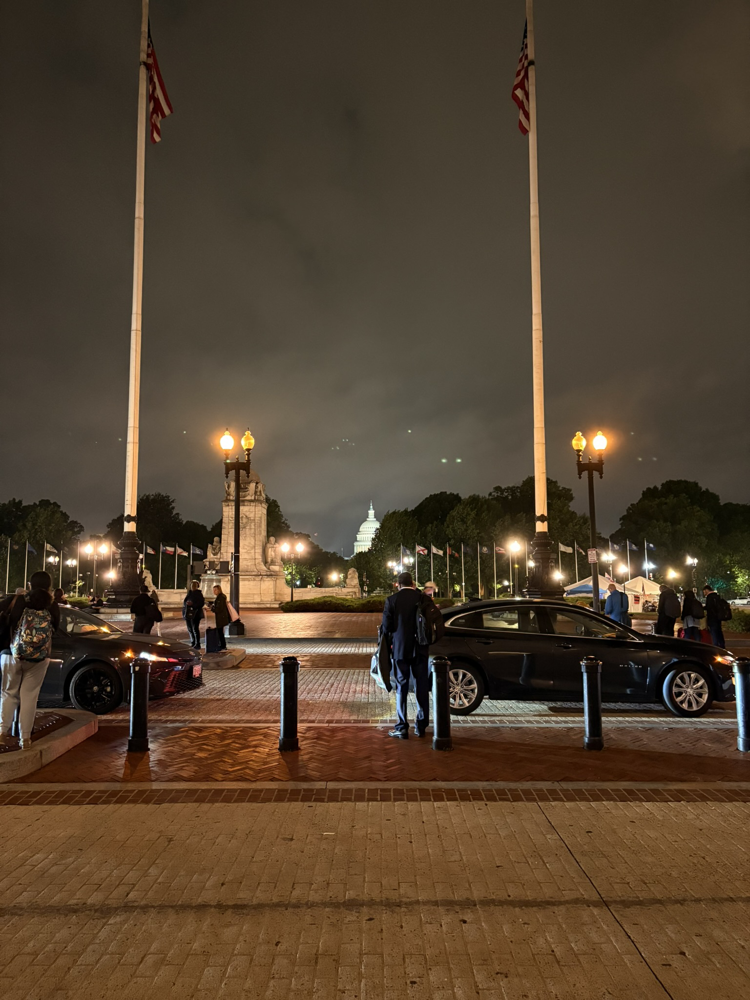
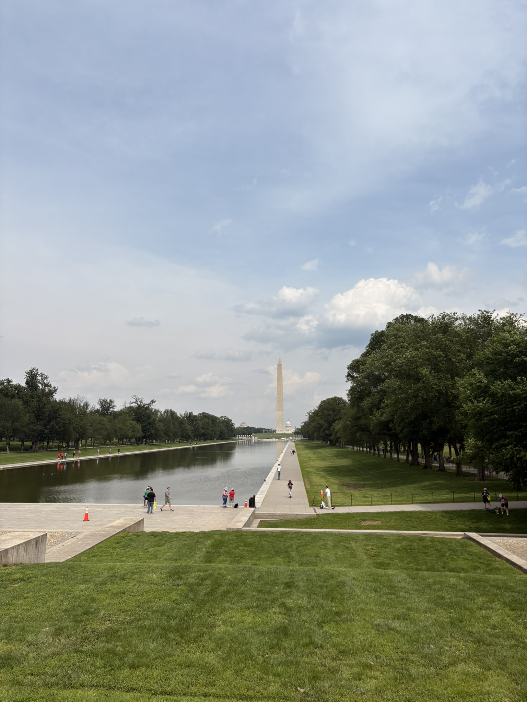
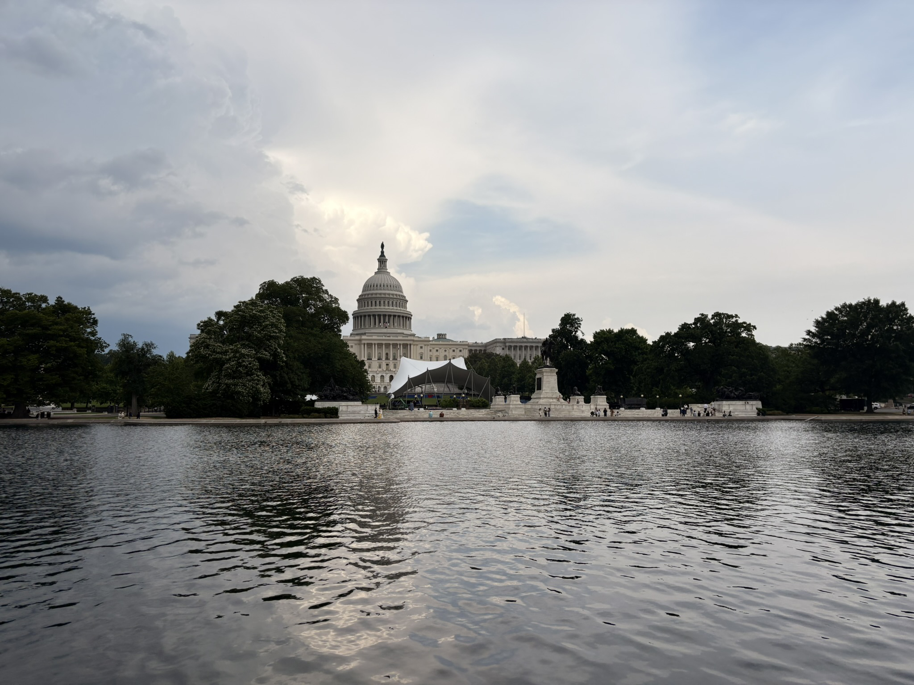
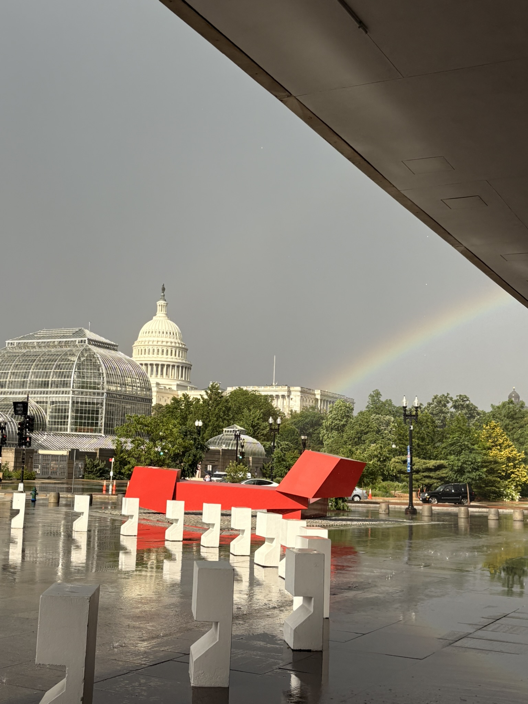
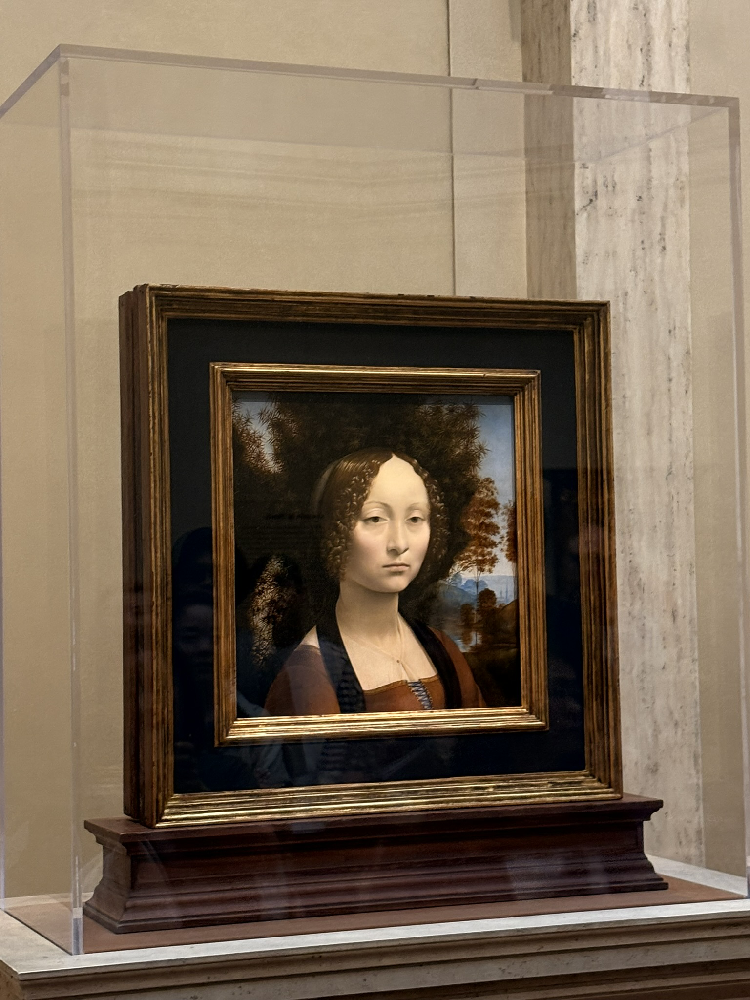
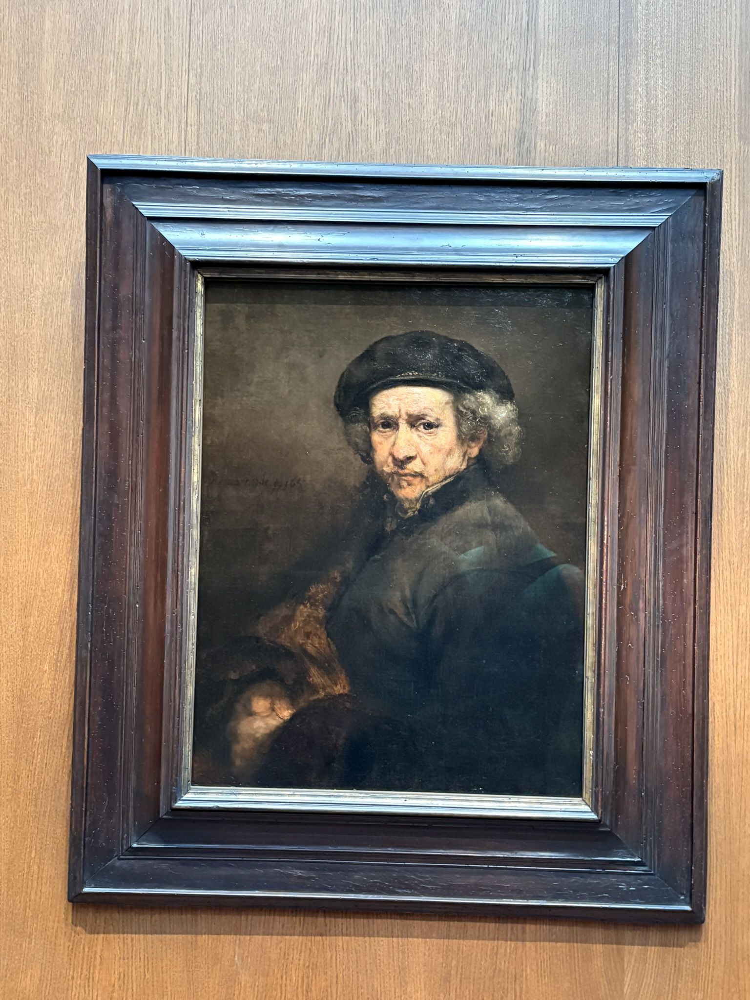
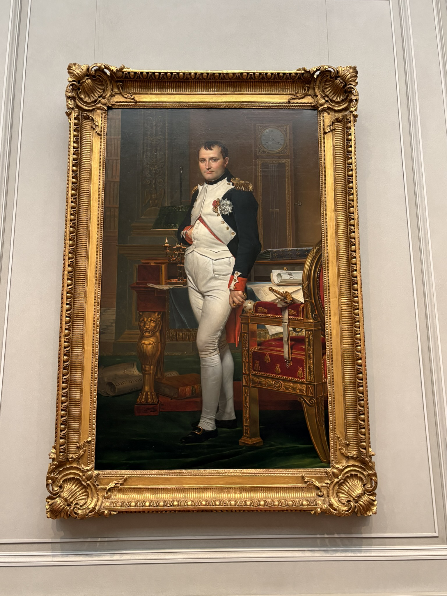
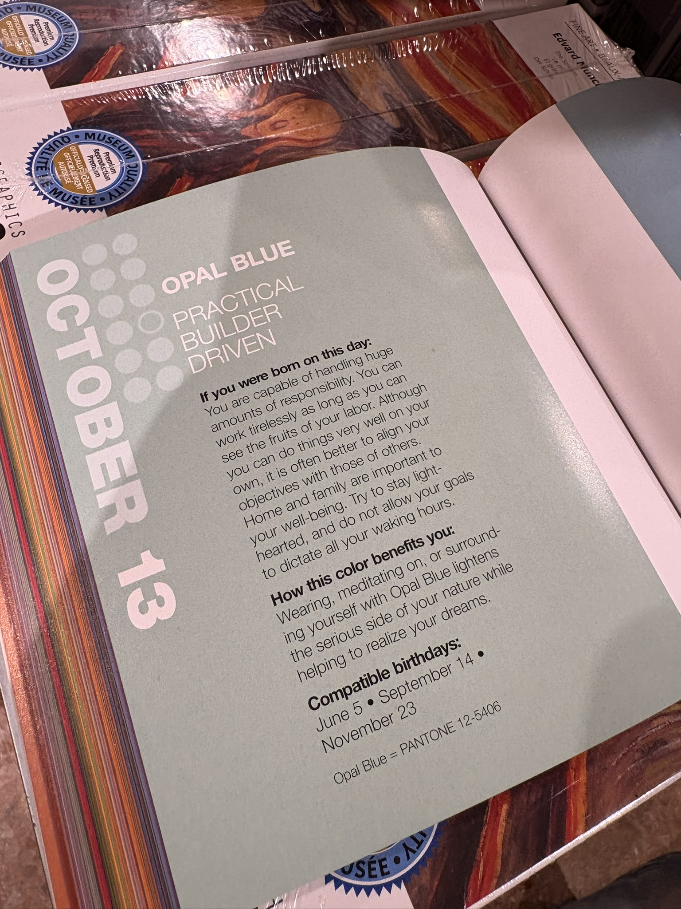

## 序言



> If I can, if I can
> Give them all the execution
> Then I can, then I can
> Be your only execution
> If I can have you back
> I will run the execution
> Though we are trapped
> We are trapped, ahhhhHHHH!!!

多年以后，我也许会想到2025年的5月14日早晨，在Salesforce Tower的圆顶还笼罩在薄雾中，5点的破晓晨光翻过山的另外一边照亮这座赛博都市，而我一边烦躁不安地思考无法完成的deadline一边在lyft网约车眺望着一望无垠的太平洋的这个时刻。

我不知道为什么我要做这个决定。

而在我还在思考这个问题的时候，我的airpods播放着这首 world.execute(me) -- 一个对于繁重机械化工作的残忍讽刺 -- 我登上了飞机，俯瞰着科罗拉多的积雪山峦，艾奥瓦的无垠平原，伊利诺伊的阴暗积云。我就这样茫然地到达了Washington D.C.

<iframe src="https://www.google.com/maps/embed?pb=!1m18!1m12!1m3!1d198741.75682057053!2d-77.32606120631833!3d38.893340736094416!2m3!1f0!2f0!3f0!3m2!1i1024!2i768!4f13.1!3m3!1m2!1s0x89b7c6de5af6e45b%3A0xc2524522d4885d2a!2sWashington%2C%20DC!5e0!3m2!1sen!2sus!4v1747623269947!5m2!1sen!2sus" width="450" height="450" style="border:0;" allowfullscreen="" loading="lazy" referrerpolicy="no-referrer-when-downgrade"></iframe>

## May 14th, 2025

到DC的时候是下午两点。下飞机的时候感受到了一股热浪袭来--这是不属于湾区的温度。IAD里头人流如潮，比较好笑的是光头白男真的很多。我饿的要命 -- 想起united上并没有可以缓解我扁桃体炎的饮品，于是不得不在飞机上一边吃消炎药一边忍受刀片嗓的折磨的我 -- 还是决定吃点简单的东西垫垫肚子。

在咀嚼油腻的芝士汉堡的时候我搜索了一下从IAD进城的公共交通。让我很惊讶的是美东的公共交通十分便利，silver line可以直接把我从IAD送到DC市区，并且轮次十分频繁。简单操作了一下smartclip之后就登上了去Arlington的列车，途中一直在和J老师发信息。

J老师在DC生活了快两年，已经是个DC老手了。她告诉我Arlington是个很好的地方。花了大概一个半小时转了一次车到了Pentagon外围，找到了我的住宿地点，一个Airbnb民宿。我的房间奇小无比，一张躺上去吱吱呀呀叫的小床和一个木头小书桌，很对的上房东开出的价格。

打开Slack，不出意外看到了无数的@。忍着内心的恼火开始处理工作。时间过的飞快，转眼间就到了晚上八点 -- 算了一下google map的时间，该去接J老师了。

住在Arlington并不等于住在DC，但是Arlington之于DC就像是Oakland之于San Francisco，一桥之隔而已。慢慢悠悠地到了Union Station，我被她的建筑风格小小惊艳了一下，这是一个有爱奥尼亚式圆柱的车站，气派的大理石拱顶和格子地板给人一种后维多利亚式风格的感觉。车站里有很多商店和餐厅，但是大多数都关门了。我猜Union Station的Union和Union Square的Union指的是一个Union。

J老师出站的时候我站在车站门口等她，我们决定一起去吃点东西。晚饭是阿富汗Kebob，味道很浓也很烈，浸渍在香料里的羊肉被包裹在面饼里被囫囵下肚。我原本嘲笑她说Kebob和土耳其Kebab完全不是一回事，后来查了一下Wikipedia之后发现其实是同一个词的不同拼写。

Arlington在吃过晚饭后下起了暴雨，我们打了辆车后就各自告别了。

## May 15th, 2025

早上醒来大概是九点钟，嘁嘁喳喳的鸟叫声和窗外的阳光把我准时叫醒了。

走到J老师住的地方的时候大概已经十一点了。DC真的很热，而且非常闷，所以汗也流不出来，让人想起走在八月福州的茶亭，如同烤炉。我们打了辆车一起去吃pho，J老师说她在DC吃过的最好的pho就是这个。果然，pho的味道很不错，汤底清淡鲜香，米粉也很Q弹，牛肉的味道也很浓郁。

我们漫步过Francis Scott Key Bridge，眺望着Potomac River。J老师说这两天下雨导致Potomac River的水位上涨了很多，原本清澈的河水变得浑浊不堪。远处的Georgetown University的校园在阳光的照耀下显得格外美丽--哥特式的尖顶和红砖墙在阳光的照耀下闪烁着金色的光芒。

我们一路聊到了Georgetown University的主校区，毕业典礼已经开始了。这所古老大学杂糅古典和现代的气息，在闪耀着露水的草坪上竖立着Hoya Saxa的标志。有很多人穿着学士服在拍照，J老师说她的同学们也在这里毕业。大概听了一下一个CNN记者的致辞，手机开始嗡嗡叫--我知道call又来了。再一次强忍恼火以及些许因为中暑的不适，我只能和J老师道别然后回到民宿继续加班。J老师非常体谅我，给我点了外卖和一些药物。

搞定工作之后已经是晚上十一点了，我精疲力竭，洗过澡之后就倒头睡了。

## May 16th, 2025

早上醒来是准时七点，喉咙还是有些沙哑。起来继续加班做poster，搞定的时候J老师还没起床。

今天的计划是造访DC的各种纪念碑。中午去了一家非常不错的意大利餐厅，鱿鱼圈十分惊艳地杂糅了鱿鱼的鲜香和牛奶的浓郁。沿着Potomac River我们租了两辆自行车，骑到了Lincoln Memorial。

林肯总统的大理石像坐在纪念碑的正中央，面朝国会大厦。四周是高耸的白色大理石柱子，阳光透过柱子洒在地上，形成了斑驳的光影。两面墙上刻着林肯总统的演讲词，字迹清晰可见。我尝试背诵了一下葛底斯堡演说，但是嗓音沙哑的我只能作罢（并且我也不太记得了），遂被J老师嘲笑。

我们继续前进到二战纪念堂和华盛顿纪念碑。二战纪念堂的水池在阳光的照耀下闪烁着金色的光芒，四周是高耸的石柱和雕塑，给人一种庄严肃穆的感觉。华盛顿纪念碑则是一个巨大的方尖碑，矗立在草坪上，象征着美国的独立和自由。

我们简单去了一下the Wharf，不知道是不是每个城市都有一个the Wharf。这里有很多餐厅和商店，气氛很热闹。在一个gelato店稍微歇了一下，J老师聊她的各种轶事，我享受冰淇淋的清凉。

简单去了一下national gallery of art，在里头小逛了一个小时就闭馆了。在此之后去了国会山，在此之前我一直以为这就是白宫。每天各种决定世界命运的论辩就在这里上演。

逛完国会山之后下了暴雨。暴雨的规模如同在新加坡一样大，而持续时长也很短，在打到车之前我们都还在屋檐下等雨。雨后出了彩虹：

晚饭和J老师的朋友们一起吃椰子鸡，同样十分下饭。J老师的朋友们都很nice，我很感谢他们都把我当作家人。

## May 17th, 2025

这是在DC的最后一天，我和J老师还有她毕业的友人一起去吃日料店。吃过午饭我表示还是想去一次国家美术馆，J老师欣然同意。

国家美术馆还是非常值得仔细逛的，馆内有很多著名的画作和雕塑，我认得的有罗丹，提香，莫奈，梵高，毕加索等等。馆内的建筑风格也很十分独特。

看到了好些名画，包括但不限于：

离开美术馆大概是五点钟，我还是想去白宫再看一眼。同样是骑自行车去的：

白宫的外观和我想象中的差不多，白色的外墙和高耸的圆顶，周围是绿树成荫的草坪。

在此之后简单再吃了一家gelato，聊聊天，就到了该离开的时候了。回去提了行李，J老师把我送到机场。临别前J老师说她会想念我的。其实我也会想念她的。

## 后记

在回SF的飞机上我又想起了那首歌。我想起了在美术馆的礼品店里看到的另外一本色彩书对我生日的评价：

> Home and family are important to your well-being.
> Try to stay light-hearted, and do not allow your goals to dictate all your waking hours. 

本来我想要在游记的结尾评价一下DC，但是我想起了J老师说的所谓城市并不重要，相处的人才是最重要的。我同意。

在下飞机的那一刻我被湾区的寒冷空气冻的直打哆嗦，但是想到接下来要做的事情，我很确信，盛夏开始了。