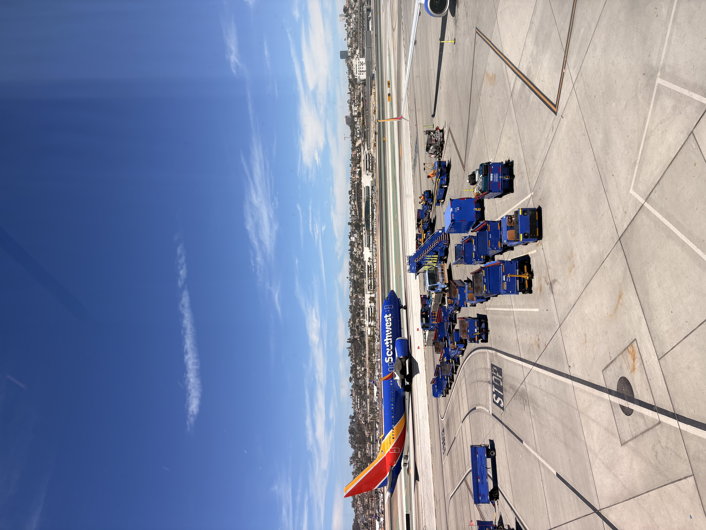
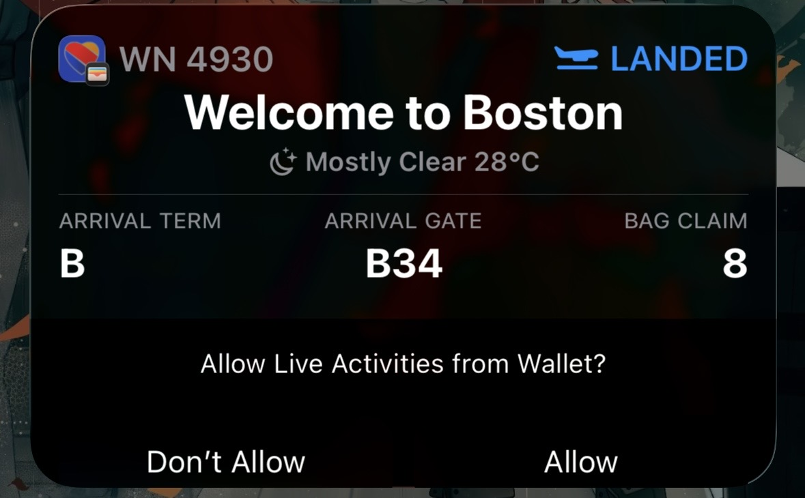

我对波士顿这座城市有一个很刻板的第一印象，作为美国革命的发源地以及诸多著名学府的大本营，以及Gilbert Strang在他的著名线性代数课里的评论：

> "somebody went to California and made a fortune; me and my wife stay in Boston to live a serene life". 

我觉得作为一个相对古典而又被现代科技所影响的城市，访问起来会非常有趣。去年由于某些原因我的SW credits还剩500，于是经过一系列SW的操作之后我成功延长了这笔credit的有效期，并买了前往波士顿的机票。我顺便联系了一下在波士顿生活的C老板，他表示很愿意在我来的时候提供他们的客厅作为一个临时住所，于是我就在2026年的独立日假期来到了这座城市。

## July 3rd, 启程

我大概在早上八点钟从家里出发开车到San Bruno的停车场。我还记得上次去DC的时候我停在Millbrae，因为San Bruno的停车场票卖完了，但是这次还有多的位置，大概一天$10，除去周末和联邦假日，我只需要花20天就可以把我的车留在机场，相当划算。San Bruno比起Millbrae还有两个好处，其一是停车场外面就有个警察局所以不用担心车车被砸（也许吧），其二是坐BART到SFO的话只需要坐yellow line，不需要坐特殊的机场快线。

因为C老板并没有多余的床给我睡，所以我把我的气垫床带上了，使用了比较大一点的行李箱。Southwest作为著名廉航，我显然需要购买多余行李，单程45刀，比起波士顿的住宿还是很划算的。登记前后我一直在看读了很久的，Andrew Roberts写的 *Napoleon: A life*， 就是这本：

没有其他干扰的情况下我读的很快，大概从阿克城战役读到雾月政变，然后读到马伦哥战役，以及拿破仑法典。

中午的时候我到了圣地亚哥，一个阳光明媚的城市：

第二程航班从两点开始起飞，我几乎没有时间吃午饭，后来证明这是一个巨大的错误，因为SW飞机上并没有餐食，所以我大概一直从早上八点之后就没有好好吃过东西。

第二程航班旁边有个美国老太太，她从Santa Clarita一家人出发到San Diego，然后飞Boston之后去Vermont她的另外一套房子度假。她是做房地产的，做了四十几年打算退休了；然后她的一家人占领了我这一排。我和她聊了很多关于湾区，中国，以及生活风格的话题。

大概晚上十一点的时候（波士顿离旧金山有3小时时差），我着陆了：

我的行李大概等了半个小时才出来，我都以为行李直挂出了问题，还特地去找了员工，所幸没有大碍。

出机场之后一股我难以想象的热浪扑面而来，简直要昏过去。打上车的时候已经是刚好过十二点了，一路狂奔到C老师家里，发现是一套老式Apartment，也没有空调，所幸客厅的风扇还能用。和C老师稍微聊了一小会之后我就洗洗睡了。