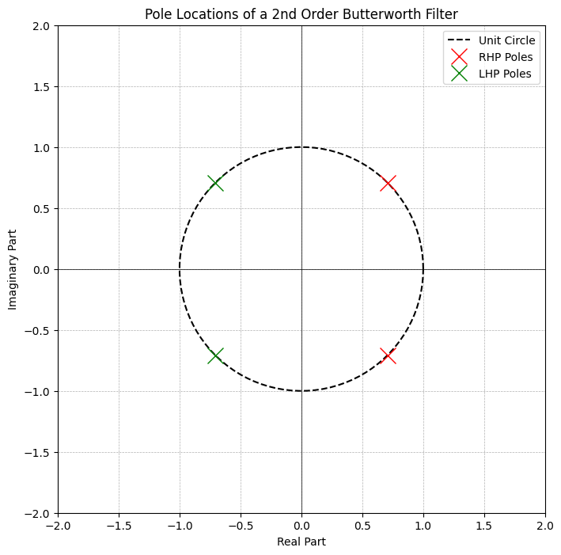
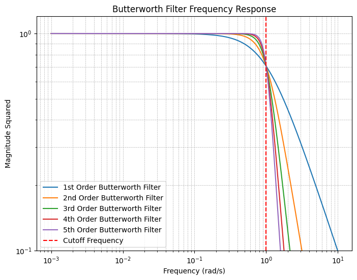

## 前言

最近在学习IIT Madras的[EE534](https://youtube.com/playlist?list=PL285BE2DDBCB6839F&si=wG2bXsgAiww36LUM)课程，该课程由Shanthi Pavan教授讲授，专注于主动滤波器设计。课程内容丰富，涵盖了实用的设计方法、严谨的理论推导以及宝贵的工程直觉。为了巩固学习成果，我将撰写一系列笔记来记录这些重要内容。正如费曼学习法所强调的，通过教授他人来验证和深化自己的理解是最有效的学习方式。

## 基本概念

在深入学习主动滤波器设计之前，我们首先需要理解一些关键概念：

- **主动元件（Active Element）**：能够提供功率增益的元件，如晶体管、运算放大器、电流源和电压源等。
- **被动元件（Passive Element）**：不能提供功率增益的元件，主要包括电阻、电容和电感等。
- **滤波器（Filter）**：根据频率特性选择性地放大或衰减信号的电路系统。
- **线性滤波器（Linear Filter）**：输出信号是输入信号线性组合的滤波器。
- **品质因子（Quality Factor, Q）**：表征滤波器频率选择性的参数，通常由中心频率与带宽的比值定义。
- **零点（Zero）**：使传递函数分子为零的复频率点，通常对应滤波器的增益极值。
- **极点（Poles）**：使传递函数分母为零的复频率点，决定滤波器的稳定性和频率响应特性。

**为什么需要使用RLC电路而非简单的RC或RL电路？**

仅使用RC或RL电路时，无法实现共轭极点对的设计，因此无法获得高品质因子滤波器所需的陡峭过渡特性。这是因为一阶RC或RL电路只能产生实数极点，而复数共轭极点对是实现高阶滤波器特性的关键。

## 主动滤波器概述

主动滤波器理论起源于1920-1950年代的早期滤波器研究，其核心目标是设计能够用多项式精确逼近理想滤波器传递函数的电路。主动滤波器通过运算放大器与被动元件（电阻、电容）的组合来实现滤波功能，避免了传统LC滤波器中电感器的使用。

这一理论催生了网络合成理论的发展，为被动网络的系统性分析和设计提供了坚实的理论基础。

滤波器按频率特性可分为低通、高通、带通和带阻滤波器等多种类型。值得注意的是，所有类型的滤波器都可以通过频率变换从低通滤波器原型导出，因此在系统设计层面，我们主要关注低通滤波器的设计即可。

## 传递函数的基本性质

### 理想低通滤波器

一个理想低通滤波器的传递函数应该具有以下特性：

$$H(s) = \frac{N(s)}{D(s)} = \begin{cases}
1 & \text{当 } 0 < \omega < 1 \\
0 & \text{当 } \omega > 1
\end{cases}$$

当我们将复变量 $s$ 替换为 $j\omega$ 时，传递函数就转化为频率响应函数。

### 传递函数的共轭性质

对于实值传递函数，以下重要性质成立：

$$|H(j\omega)|^2 = H(j\omega)H^*(j\omega) = H(j\omega)H(-j\omega)$$

这意味着给定传递函数，我们可以直接计算其幅度函数。

### 从幅度函数重构传递函数

反过来，如果我们已知幅度函数并希望求得传递函数，可以通过将 $\omega$ 替换为 $s/j$ 来实现。然而，这种方法需要求解二次方程，并且需要合理选择根。

幸运的是，对于物理可实现的传递函数，以下约束条件必须满足：

- **零点**：可以位于复平面的任意位置
- **极点**：必须位于左半平面（$\text{Re}(s) < 0$），否则系统将不稳定

对于实值传递函数，其幅度函数是偶函数，相位函数是奇函数。

我们将在后面的笔记中说明，实际上对于纯LC滤波器，传递函数的极点和零点分布具有更严格的几何特性。

### 全极点滤波器

如果传递函数在有限频率范围内没有零点，则称为**全极点滤波器**（All-Pole Filter）。这类滤波器的设计和分析相对简单，是滤波器设计的重要基础。

## 巴特沃斯滤波器（Butterworth Filter）

### 设计思路与幅度函数

对于全极点滤波器，我们假设其传递函数为：

$$|H(j\omega)|^2 = \frac{1}{D(j\omega)D(-j\omega)} = \frac{1}{D_1(\omega^2)}$$

需要注意的是，如果传递函数是 $N$ 阶的，那么其幅度平方函数将是 $\omega^2$ 的 $N$ 次有理函数。

我们希望 $D_1(\omega^2)$ 满足以下理想特性：

$$
D_1(\omega^2) = \begin{cases}
1 & \text{当 } 0 < \omega < 1 \\
\infty & \text{当 } 1 < \omega < \infty
\end{cases}
$$

### 多项式逼近

设：
$$D_1(\omega^2) = 1 + F(\omega^2)$$

则我们需要：
$$\begin{equation}
F(\omega^2) = \begin{cases}
0 & \text{当 } 0 < \omega < 1 \\
\infty & \text{当 } 1 < \omega < \infty
\end{cases}
\end{equation}$$

由于系统的线性特性，传递函数必须是有理函数，因此：

$$F(\omega^2) = f_0 + f_1\omega^2 + f_2\omega^4 + \cdots + f_N\omega^{2N}$$

### 最大平坦逼近

在 $\omega \to 0$ 时，高阶项趋于零，因此：
$$F(\omega^2) \approx f_1\omega^2$$

为使 $F(\omega^2) = 0$，我们需要 $f_1 = 0$。

通过类似的分析，可以得出 $f_2 = f_3 = \cdots = f_{N-1} = 0$。

但是 $f_N$ 不能为零，否则滤波器将失去滤波特性。因此，我们能够实现的最佳逼近是：

$$F(\omega^2) = f_N\omega^{2N}$$

### 巴特沃斯响应

取 $f_N = 1$，我们得到：

$$|H(j\omega)|^2 = \frac{1}{1 + \omega^{2N}}$$

这就是著名的**巴特沃斯滤波器** 的幅度平方函数。

当 $\omega = 1$ 时，$|H(j\omega)|^2 = \frac{1}{2}$，对应 -3dB 点，这定义了巴特沃斯滤波器的截止频率。

这种设计在 $\omega = 0$ 处实现了**最大平坦** 特性，即在通带内具有最平坦的响应。

### 极点分布分析

现在我们来分析巴特沃斯滤波器的极点分布。由于 $D(s)$ 是 $N$ 阶多项式，我们可以建立以下方程：

$$D(s)D(-s) = 1 + (-s^2)^N = 1 + (-1)^N s^{2N}$$

### 极点的对称性

如果 $\sigma_0 + j\omega_0$ 是该方程的一个根，那么以下四个点都是方程的解：
- $\sigma_0 + j\omega_0$（原根）
- $\sigma_0 - j\omega_0$（共轭根）
- $-\sigma_0 + j\omega_0$（负根）
- $-\sigma_0 - j\omega_0$（共轭负根）

这种对称性对所有有理函数都成立。然而，根据物理可实现性要求，极点必须位于左半平面以保证系统稳定性，因此我们只选择左半平面的极点。

### 二阶巴特沃斯滤波器示例

**例：** 考虑 $N = 2$ 的情况。

方程 $1 + s^4 = 0$ 的解为：
$$s^4 = -1 = e^{j(\pi + 2k\pi)}, \quad k = 0, 1, 2, 3$$

因此四个根为：
$$s = e^{j\pi/4}, \quad e^{j3\pi/4}, \quad e^{j5\pi/4}, \quad e^{j7\pi/4}$$

转换为直角坐标：
$$s = e^{j\pi/4} = \frac{1}{\sqrt{2}} + j\frac{1}{\sqrt{2}}$$
$$s = e^{j3\pi/4} = -\frac{1}{\sqrt{2}} + j\frac{1}{\sqrt{2}}$$
$$s = e^{j5\pi/4} = -\frac{1}{\sqrt{2}} - j\frac{1}{\sqrt{2}}$$
$$s = e^{j7\pi/4} = \frac{1}{\sqrt{2}} - j\frac{1}{\sqrt{2}}$$

选择左半平面的极点：
$$s_1 = -\frac{1}{\sqrt{2}} + j\frac{1}{\sqrt{2}}, \quad s_2 = -\frac{1}{\sqrt{2}} - j\frac{1}{\sqrt{2}}$$

### 传递函数的构造

根据极点位置，我们可以构造二阶巴特沃斯滤波器的分母多项式：

$$D(s) = (s - s_1)(s - s_2) = s^2 + \sqrt{2}s + 1$$

### 滤波器参数分析

将此结果与二阶系统的标准形式 $s^2 + \frac{\omega_n}{Q}s + \omega_n^2$ 对比：

- ** 自然频率**：$\omega_n = 1$
- ** 品质因子**：$Q = \frac{1}{\sqrt{2}} \approx 0.707$

与一阶巴特沃斯滤波器相比，二阶滤波器具有更高的品质因子，从而实现更陡峭的滚降特性。

### 极点分布的几何特性

从极点分布可以看出，巴特沃斯滤波器的极点均匀分布在单位圆上，且仅选择左半平面的极点以确保系统稳定性。这种均匀分布是巴特沃斯滤波器具有最大平坦特性的根本原因。

### 常用的巴特沃斯滤波器多项式表

| 阶数 $N$ | 分母多项式 $D(s)$               | 极点位置                           |
|----------|----------------------------------|-------------------------------------|
| 1        | $s + 1$                          | $-1$                                |
| 2        | $s^2 + \sqrt{2}s + 1$ | $-\frac{1}{\sqrt{2}} + j\frac{1}{\sqrt{2}}, -\frac{1}{\sqrt{2}} - j\frac{1}{\sqrt{2}}$ |
| 3        | $s^3 + 2s^2 + 2s + 1$ | $-\frac{1}{\sqrt{3}} + j\frac{1}{\sqrt{3}}, -\frac{1}{\sqrt{3}} - j\frac{1}{\sqrt{3}}, -1$ |
| 4        | $s^4 + 2\sqrt{2}s^3 + 4s^2 + 2\sqrt{2}s + 1$ | $-\frac{1}{2} + j\frac{1}{2}, -\frac{1}{2} - j\frac{1}{2}, -\frac{1}{2} + j\frac{1}{2}, -\frac{1}{2} - j\frac{1}{2}$ |
| 5       | $s^5 + 2\sqrt{3}s^4 + 5s^3 + 2\sqrt{3}s^2 + 1$ | $-\frac{1}{\sqrt{5}} + j\frac{1}{\sqrt{5}}, -\frac{1}{\sqrt{5}} - j\frac{1}{\sqrt{5}}, -1, -\frac{1}{\sqrt{5}} + j\frac{1}{\sqrt{5}}, -\frac{1}{\sqrt{5}} - j\frac{1}{\sqrt{5}}$ |

可以发现，当阶数为奇数的时候，-1一定是极点之一，而当阶数为偶数时，-1不是极点。而无论阶数如何，都没有极点会落在j轴上。

### 巴特沃斯滤波器的Bode Plot

---