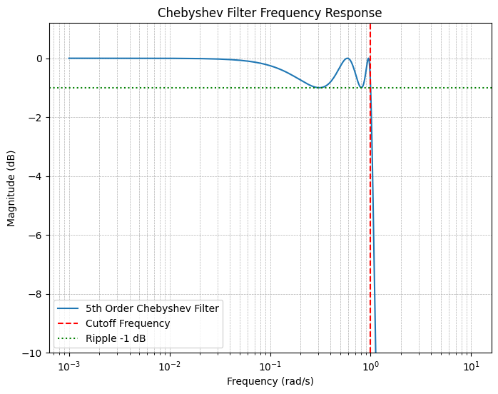
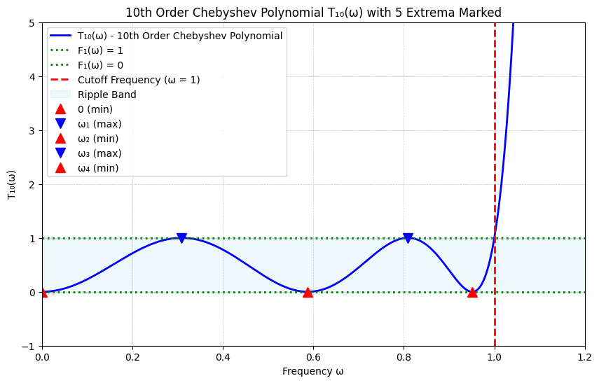
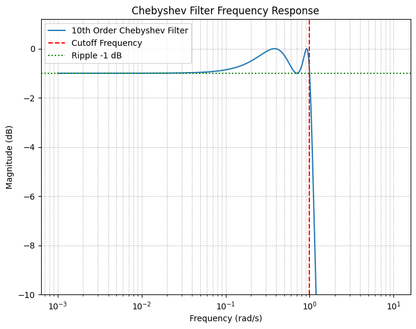
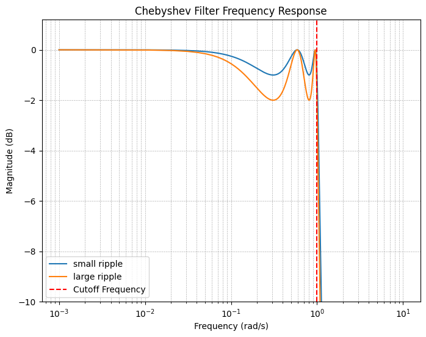
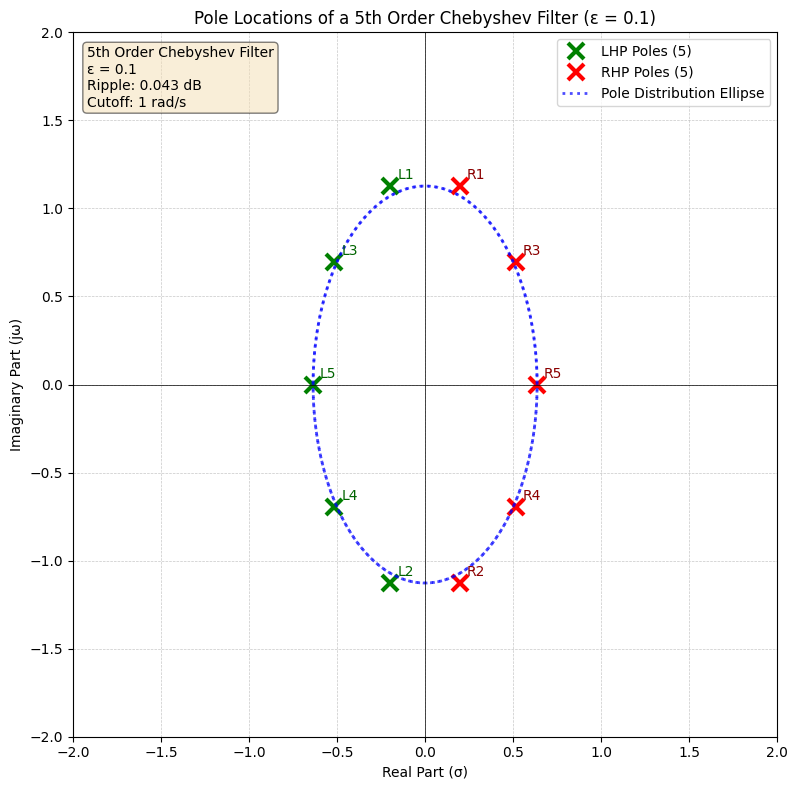

在上一篇中，我们讨论了巴特沃斯近似的设计方法及其特性。在深入探讨新的滤波器设计方法之前，我们需要首先分析一个关键问题：

## 1. 巴特沃斯滤波器的局限性分析

巴特沃斯滤波器因其设计简单而在滤波器工程中被广泛采用。然而，在某些应用场景下，巴特沃斯滤波器并非最优选择。

对于一个N阶滤波器，物理实现所需的最少无源元件（电感或电容）数量为N个。在实际工程设计中，通常给定通带最小增益和阻带最大增益的技术指标。巴特沃斯滤波器在通带内具有最大平坦特性，但这一特性在满足给定规格时可能过于严格。

如本文将要证明的，切比雪夫滤波器通过在通带内引入可控的纹波，能够以更低的阶数实现相同的阻带衰减性能。这一特性在早期模拟滤波器设计中具有重要意义，因为较少的元件意味着更低的成本和更小的体积。即使在现代集成电路设计中，减少电容和电感的使用仍然意味着更小的芯片面积和更低的功耗。

## 2. 第一类切比雪夫滤波器

### 设计原理与幅度响应特性

切比雪夫滤波器的典型幅度响应如下图所示：

我们引入参数$\epsilon$来控制通带内的纹波幅度。定义滤波器的幅度平方响应为：

$$|H(j\omega)|^2 = \frac{1}{D(\omega^2)} = \frac{1}{1 + \epsilon^2 F_1(\omega^2)}$$

其中$F_1(\omega^2)$的理想特性函数应具有如下形式：

### 切比雪夫多项式的数学推导

#### 插值法构造多项式

基于$F_1$在$0$、$\omega_2$、$\omega_4$处的零点，可以构造如下多项式插值：

$$F_1(\omega^2) = k^2 \omega^2 (\omega^2 - \omega_2^2)^2(\omega^2 - \omega_4^2)^2$$

对于$F_1(\omega^2) - 1$，考虑到其在$\omega_1$、$\omega_3$、$1$处的零点，可得：

$$F_1(\omega^2) - 1 = k^2 (\omega^2 - \omega_1^2)(\omega^2 - \omega_3^2)(\omega^2 - 1)$$

设$C_5(\omega)^2 = F_1(\omega^2)$，则：

$$C_5(\omega) = k \omega (\omega^2 - \omega_2^2)(\omega^2 - \omega_4^2)$$

由于$C_5$在$\omega_1$、$\omega_3$处取得极值，对其求导可得：

$$\frac{dC_5(\omega)}{d\omega} = k_{unknown}(\omega^2 - \omega_1^2)(\omega^2 - \omega_3^2)$$

#### 微分方程的建立与求解

当$\omega \to \infty$时，$C_5(\omega) \approx k \omega^5$，因此其导数的主导项系数为$5k$，从而$k_{unknown} = 5k$。

比较$F_1 - 1$的两种表达式，可建立如下微分方程：

$$(\frac{1}{5}\frac{dC_5}{d\omega})^2 = \frac{C_5^2 - 1}{\omega^2 - 1}$$

整理得：

$$\frac{dC_5}{\sqrt{C_5^2 - 1}} = \frac{5 d\omega}{\sqrt{\omega^2 - 1}}$$

对两边积分：

$$
\begin{aligned}
\int \frac{dC_5}{\sqrt{C_5^2 - 1}} &= \int \frac{5 d\omega}{\sqrt{\omega^2 - 1}} \\
\cosh^{-1}(C_5) &= 5 \cosh^{-1}(\omega) + C_{constant}
\end{aligned}
$$

应用边界条件$C_5(1) = 1$，得$C_{constant} = -5 \cosh^{-1}(1) = 0$。

因此：

$$C_5(\omega) = \cosh(5\cosh^{-1}(\omega))$$

#### 一般化结果

将上述结果推广至n阶情况：

$$C_n(\omega) = \cosh(n \cosh^{-1}(\omega))$$

### 切比雪夫多项式的完整定义

#### 三角函数与双曲函数的关系

根据欧拉公式和双曲函数的定义，可得关键关系：

$$\cosh(jx) = \cos(x), \quad \cos(jx) = \cosh(x)$$

对于反函数的关系：
- 当$x > 1$时：$\cos^{-1}(x) = j \cosh^{-1}(x)$
- 当$0 < x < 1$时：$\cosh^{-1}(x) = j \cos^{-1}(x)$

#### 切比雪夫多项式的定义

基于上述关系，切比雪夫多项式的完整定义为：

$$T_n(\omega) = \begin{cases}
\cosh(n \cosh^{-1}(\omega)), & \text{当 }\omega \geq 1 \\
\cos(n \cos^{-1}(\omega)), & \text{当 }0 \leq \omega \leq 1
\end{cases}$$

#### 多项式性质的验证

对于$|\omega| \leq 1$的情况，可以验证：

$$
\begin{aligned}
T_1(\omega) &= \cos(\cos^{-1}(\omega)) = \omega \\
T_2(\omega) &= \cos(2\cos^{-1}(\omega)) = 2\omega^2 - 1
\end{aligned}
$$

通过三角恒等式（倍角公式），可证明$T_n(\omega)$确实是$\omega$的n次多项式。

### 切比雪夫滤波器的工程术语

这种多项式以俄国数学家帕夫努季·切比雪夫（Pafnuty Chebyshev）命名，称为**切比雪夫多项式**。基于切比雪夫近似的滤波器称为**切比雪夫滤波器**，在文献中也常见以下术语：

- **等纹波滤波器（Equal Ripple Filter）**
  - 因其通带内的最大纹波幅度恒定
  
- **最小最大值滤波器（Minimax Filter）**
  - 基于切比雪夫定理：在所有可能的n次多项式中，切比雪夫多项式使得其在给定区间内的最大偏差最小

## 3. 切比雪夫多项式的重要性质

### 偶数阶与奇数阶的区别

偶数阶切比雪夫多项式和奇数阶的最大最小值分布存在显著差异。

**例题**：四阶切比雪夫多项式在角频率为0时的值

$$T_4(0) = \cos(4\cos^{-1}(0)) = \cos(4 \times \frac{\pi}{2}) = \cos(2\pi) = 1$$

**重要结论**：
- 偶数阶切比雪夫多项式：在$\omega = 0$处取最大值
- 奇数阶切比雪夫多项式：在$\omega = 0$处取最小值

这导致偶数阶切比雪夫滤波器在直流处的幅度响应不为1，而是$\frac{1}{\sqrt{1 + \epsilon^2}}$，如下图所示：

### 通带极值点的分布

#### 通带最大值

通带最大值对应于切比雪夫多项式的最小值：

$$\cos(n \cos^{-1}(\omega)) = 0$$

解得：

$$\omega = \cos\left(\frac{(2m + 1)\pi}{2n}\right), \quad m = 0, 1, \ldots, n - 1$$

#### 通带最小值

通带最小值对应于切比雪夫多项式的最大值：

$$\cos(n \cos^{-1}(\omega)) = 1$$

解得：

$$\omega = \cos\left(\frac{2m\pi}{n}\right), \quad m = 0, 1, \ldots, n - 1$$

### 纹波与阻带衰减的关系

通过允许一定的纹波，切比雪夫滤波器能够在通带内实现更陡峭的滚降特性。纹波越大，阻带衰减也越大：

**特殊情况**：当$\epsilon = 0$时，切比雪夫滤波器退化为巴特沃斯滤波器。

## 4. 切比雪夫滤波器的极点分析

### 极点方程的建立

切比雪夫滤波器的极点满足：

$$1 + \epsilon^2 T_n^2(\omega) = 0$$

即：

$$\cos(n \cos^{-1}(\frac{s}{j})) = \pm \frac{j}{\epsilon}$$

### 极点的求解过程

设$n \cos^{-1}(\frac{s}{j}) = u + jv$，其中$u, v \in \mathbb{R}$。

使用三角恒等式：

$$\cos(u + jv) = \cos u \cosh v - j \sin u \sinh v = \pm \frac{j}{\epsilon}$$

分离实部和虚部：

$$\begin{cases}
\cos u \cosh v = 0 \\
-\sin u \sinh v = \pm \frac{1}{\epsilon}
\end{cases}$$

由于$u$和$v$是实数，要使实部为0，必须满足：

$$u = (2m + 1) \frac{\pi}{2}, \quad m = 0, 1, 2, \ldots$$

这使得$\sin u = (-1)^m$。解第二个方程：

$$v = \pm \sinh^{-1}\frac{1}{\epsilon}$$

### 极点的最终表达式

代入得到极点的形式：

$$s = \pm \sin\left(\frac{(2m + 1) \pi}{2n}\right) \sinh\left(\frac{1}{n}\sinh^{-1}\frac{1}{\epsilon}\right) + j \cos\left(\frac{(2m + 1) \pi}{2n}\right) \cosh\left(\frac{1}{n}\sinh^{-1}\frac{1}{\epsilon}\right)$$

### 极点的几何分布

极点的实部和虚部分别为：

$$\begin{cases}
\sigma_0 = \pm \sin\left(\frac{(2m + 1) \pi}{2n}\right) \sinh\left(\frac{1}{n}\sinh^{-1}\frac{1}{\epsilon}\right) \\
\omega_0 = \cos\left(\frac{(2m + 1) \pi}{2n}\right) \cosh\left(\frac{1}{n}\sinh^{-1}\frac{1}{\epsilon}\right)
\end{cases}$$

可以得到椭圆方程：

$$\frac{\sigma_0^2}{\sinh^2\left(\frac{1}{n}\sinh^{-1}\frac{1}{\epsilon}\right)} + \frac{\omega_0^2}{\cosh^2\left(\frac{1}{n}\sinh^{-1}\frac{1}{\epsilon}\right)} = 1$$

这表明切比雪夫滤波器的极点分布在椭圆上，椭圆的半长轴和半短轴分别为：
- 半长轴（虚轴）：$\cosh\left(\frac{1}{n}\sinh^{-1}\frac{1}{\epsilon}\right)$
- 半短轴（实轴）：$\sinh\left(\frac{1}{n}\sinh^{-1}\frac{1}{\epsilon}\right)$

**特殊情况**：当$\epsilon \to 0$时，椭圆退化为单位圆，对应巴特沃斯滤波器。

以下是5阶切比雪夫滤波器的极点分布示意图（$\epsilon = 0.1$）：

在下一篇中，我们将讨论切比雪夫滤波器的变种，即**第二类切比雪夫滤波器**，也被称为**反切比雪夫滤波器**。