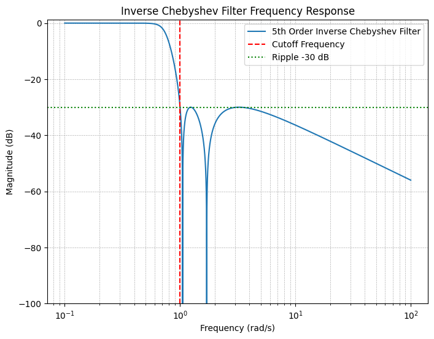
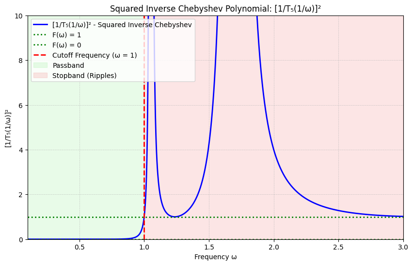
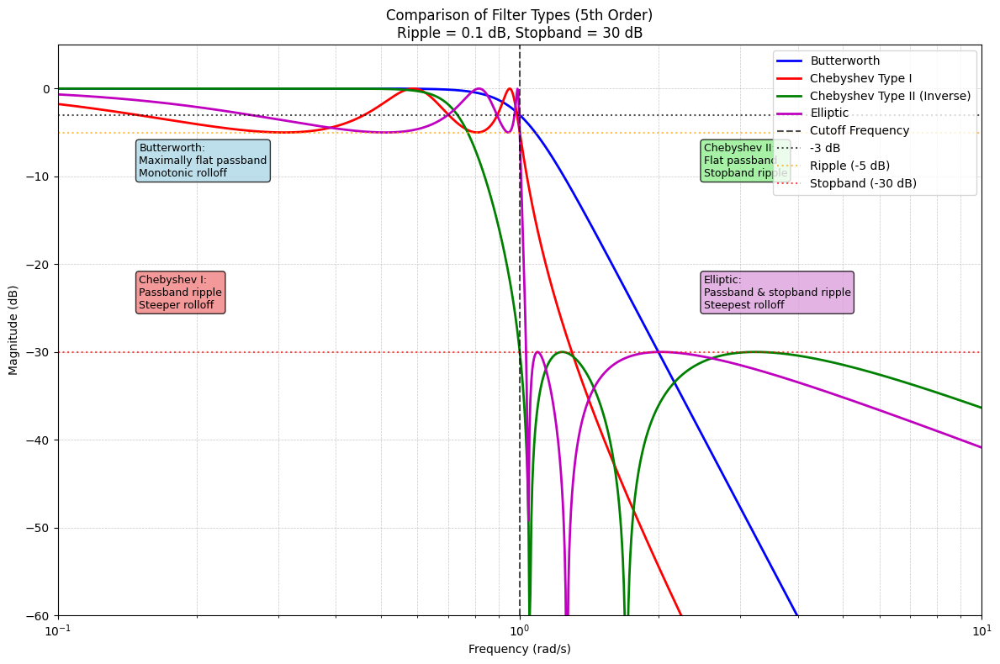

## 引言

在前一节中，我们详细讨论了切比雪夫滤波器的设计原理与数学推导。简言之，切比雪夫滤波器通过允许**通带(passband)** 内的纹波来实现更陡峭的过渡带，从而在给定的阻带衰减要求下，使用更少的元件。我们可以把切比雪夫滤波器视为巴特沃斯滤波器的一种推广。

然而，切比雪夫滤波器和巴特沃斯滤波器对**阻带(stopband)** 没有任何特殊要求，这也就是说这两个滤波器专注于设计通带的特性，而阻带的特性是伴随而来的。**第二类切比雪夫滤波器(Inverse Chebyshev Filter)** 则是切比雪夫滤波器的一个变种，它允许在阻带内引入纹波，从而进一步优化通带和阻带的特性；然而通带的特性便是伴随而来的。

## 1. 第二类切比雪夫滤波器的基本特性

第二类切比雪夫滤波器，也被称为**反切比雪夫滤波器(Inverse Chebyshev Filter)** ，是切比雪夫滤波器的一个变种。它的幅度响应如下：

可以看到，第二类切比雪夫滤波器在阻带内引入了纹波。第二类切比雪夫滤波器相比切比雪夫滤波器而言，有了一个本质上的区别：由于阻带内的纹波，我们需要在阻带内引入零点。也就是说，第二类切比雪夫滤波器的传递函数不再是一个全极点滤波器。我们将在后面的章节中看到，这个区别将导致第二类切比雪夫滤波器在电路实现上有显著区别。

### 1.1 主要特点总结

- **通带特性**：最大平坦（类似巴特沃斯滤波器）
- **阻带特性**：等纹波响应
- **传递函数**：既有极点也有零点
- **滚降速度**：由于阻带零点的存在，比巴特沃斯滤波器更快

## 2. 第二类切比雪夫滤波器的数学推导

### 2.1 幅度响应函数的构造

我们同样来构造幅度响应的分母函数。与第一类切比雪夫滤波器类似，我们定义：

$$|H(j\omega)|^2 = \frac{1}{1 + \frac{1}{\epsilon^2} F(\omega^2)}$$

$F$函数应该长得像这样：

可以发现，如果经过x轴和y轴的反函数变换，$F$函数可以直接用切比雪夫多项式来表示：

$$F(\omega^2) = \frac{1}{T_n^2\left(\frac{1}{\omega}\right)}$$

### 2.2 完整的幅度响应表达式

因此，第二类切比雪夫滤波器的幅度响应可以表示为：

$$|H(j\omega)|^2 = \frac{\epsilon^2 T_n^2\left(\frac{1}{\omega}\right)}{1 + \epsilon^2 T_n^2\left(\frac{1}{\omega}\right)}$$

或者等价地写成：

$$|H(j\omega)|^2 = \frac{1}{1 + \frac{1}{\epsilon^2 T_n^2\left(\frac{1}{\omega}\right)}}$$

### 2.3 极点的求解

如果要求得第二类切比雪夫滤波器的极点，我们需要解以下方程：

$$1 + \frac{1}{\epsilon^2 T_n^2\left(\frac{s}{j}\right)} = 0$$

即：

$$T_n\left(\frac{s}{j}\right) = \pm \frac{j}{\epsilon}$$

利用第一类切比雪夫滤波器的极点结果，通过变换$s \to \frac{1}{s}$，我们可以得到第二类切比雪夫滤波器的极点。

如果第一类切比雪夫滤波器的极点为$p_k$，则第二类切比雪夫滤波器的极点为：

$$p_{k,inv} = \frac{1}{p_k}$$

## 3. 设计实例：三阶第二类切比雪夫滤波器

### 3.1 极点的计算

让我们来设计一个三阶的第二类切比雪夫滤波器。

首先，从上一节可以求得，三阶切比雪夫滤波器的三个极点为：

$$\begin{aligned}
p_1, p_2 &= -\sin\frac{\pi}{6} \sinh\left(\frac{1}{3}\sinh^{-1}\frac{1}{\epsilon}\right) \\
&\quad \pm j \cos\frac{\pi}{6} \cosh\left(\frac{1}{3}\sinh^{-1}\frac{1}{\epsilon}\right) \\
p_3 &= -\sin\frac{\pi}{2} \sinh\left(\frac{1}{3}\sinh^{-1}\frac{1}{\epsilon}\right)
\end{aligned}$$

切比雪夫滤波器的分母函数因此可以表示为：

$$\begin{aligned}
D(s) &= \left(1 - \frac{s}{p_1}\right)\left(1 - \frac{s}{p_2}\right)\left(1 - \frac{s}{p_3}\right) \\
&= 1 + a_1 s + a_2 s^2 + a_3 s^3
\end{aligned}$$

那么对于第二类切比雪夫滤波器，它的分母就应该是：

$$D_{inv}(s) = s^3 + a_1 s^2 + a_2 s + a_3$$

### 3.2 零点的计算

除了极点之外，我们还需要求得第二类切比雪夫滤波器的零点。零点满足：

$$\epsilon^2 T_n^2\left(\frac{1}{\omega_z}\right) = 0$$

在这个例子中：

$$T_3\left(\frac{1}{\omega_z}\right) = \cos\left(3 \cos^{-1}\left(\frac{1}{\omega_z}\right)\right) = 0$$

因此，零点满足：

$$3 \cos^{-1}\left(\frac{1}{\omega_z}\right) = \frac{(2k+1)\pi}{2}, \quad k = 0, 1, 2$$

即：

$$\frac{1}{\omega_z} = \cos\left(\frac{(2k+1)\pi}{6}\right), \quad k = 0, 1, 2$$

计算得到零点为：

$$\begin{aligned}
\omega_{z1}, \omega_{z2} &= \pm \frac{1}{\cos\left(\frac{\pi}{6}\right)} = \pm \frac{2}{\sqrt{3}} \\
\omega_{z3} &= \frac{1}{\cos \left(\frac{\pi}{2}\right)} = \infty
\end{aligned}$$

因此我们可以看到三阶第二类切比雪夫滤波器有两个有限的零点和一个无限零点。

### 3.3 传递函数的完整形式

三阶第二类切比雪夫滤波器的传递函数可以写成：

$$H(s) = K \frac{s^2 + \omega_{z1}^2}{s^3 + a_1 s^2 + a_2 s + a_3}$$

其中$K$是增益常数，通过归一化条件确定。

## 4. 偶数阶第二类切比雪夫滤波器的特殊性质

对于偶数阶第二类切比雪夫滤波器而言，在$\omega \to \infty$的时候，幅度响应并不会趋近于0，而是会趋近于：

$$\lim_{\omega \to \infty} |H(j\omega)| = \frac{\epsilon}{\sqrt{1 + \epsilon^2}}$$

这个特性带来了一个重要的工程后果：我们将无法使用被动元件实现偶数阶第二类切比雪夫滤波器。这是因为被动LC滤波器在高频时的增益必须趋于零，而偶数阶反切比雪夫滤波器在高频时具有非零增益。

## 5. 第二类切比雪夫滤波器的通带分析

第二类切比雪夫滤波器在通带中会有怎样的特性？我们通过使$\omega \to 0$来分析通带的特性。

在$\omega \to 0$时，以下近似成立：

$$\cos^{-1}\frac{1}{\omega} \approx \ln\frac{2}{\omega}$$

$$\cosh\left(n \cos^{-1}\frac{1}{\omega}\right) \approx \frac{1}{2} e^{n \ln\frac{2}{\omega}} = \frac{1}{2}\left(\frac{2}{\omega}\right)^n$$

因此：

$$\begin{aligned}
|H(j\omega)|^2 &\approx \frac{1}{1 + \frac{1}{\epsilon^2 \left(\frac{2}{\omega}\right)^{2n}}} \\
&= \frac{1}{1 + \frac{\omega^{2n}}{4^n \epsilon^2}} \\
&= \frac{1}{1 + \frac{1}{4^n \epsilon^2}\omega^{2n}}
\end{aligned}$$

这表明在通带中第二类切比雪夫滤波器趋近于巴特沃斯滤波器的响应形式，但是由于阻带的零点，滚降速度会更快。

## 6. 椭圆函数滤波器简介

我们看到在通带和在阻带中引入纹波可以改善滤波器的滚降速度。是否能够在通带和阻带中都引入纹波，从而进一步改善滚降速度呢？答案是肯定的，这就是**椭圆函数滤波器(Elliptic Filter)** 。

椭圆函数滤波器的主要特点：
- **通带**：等纹波响应
- **阻带**：等纹波响应
- **滚降速度**：在所有滤波器类型中最陡峭
- **复杂性**：数学推导最为复杂，需要椭圆积分理论

椭圆函数滤波器允许在通带和阻带中都引入纹波，从而实现最陡峭的滚降速度。椭圆函数滤波器的数学推导涉及椭圆积分和雅可比椭圆函数，较为复杂，我们这里不再详细展开。

## 7. 总结与对比

### 7.1 四种经典滤波器的比较

| 滤波器类型 | 通带特性 | 阻带特性 | 滚降速度 | 实现复杂度 |
|------------|----------|----------|----------|------------|
| 巴特沃斯   | 最大平坦 | 单调下降 | 最慢     | 最简单     |
| 切比雪夫I  | 等纹波   | 单调下降 | 较快     | 中等       |
| 切比雪夫II | 最大平坦 | 等纹波   | 较快     | 中等       |
| 椭圆函数   | 等纹波   | 等纹波   | 最快     | 最复杂     |

### 7.2 设计选择指南

- **巴特沃斯滤波器**：适用于对通带平坦度要求极高的应用
- **第一类切比雪夫滤波器**：适用于对阻带衰减要求较高，可以容忍通带纹波的应用
- **第二类切比雪夫滤波器**：适用于对通带平坦度要求较高，可以容忍阻带纹波的应用
- **椭圆函数滤波器**：适用于对滚降速度要求极高，可以容忍通带和阻带纹波的应用

下图展示了四种滤波器的典型幅度响应：

## 8. 常用的切比雪夫多项式表

| 阶数$n$ | 切比雪夫多项式 $T_n(x)$ |
|---------|-------------------------|
| 1       | $x$                     |
| 2       | $2x^2 - 1$              |
| 3       | $4x^3 - 3x$             |
| 4       | $8x^4 - 8x^2 + 1$       |
| 5       | $16x^5 - 20x^3 + 5x$    |
| 6       | $32x^6 - 48x^4 + 18x^2 - 1$ |
| 7       | $64x^7 - 112x^5 + 56x^3 - 7x$ |

### 8.1 递推关系

切比雪夫多项式满足以下递推关系：

$$T_{n+1}(x) = 2xT_n(x) - T_{n-1}(x)$$

其中：
- $T_0(x) = 1$
- $T_1(x) = x$

这个递推关系为高阶切比雪夫多项式的计算提供了便利。

---

在下一篇中，我们将讨论这些滤波器的实际电路实现方法。