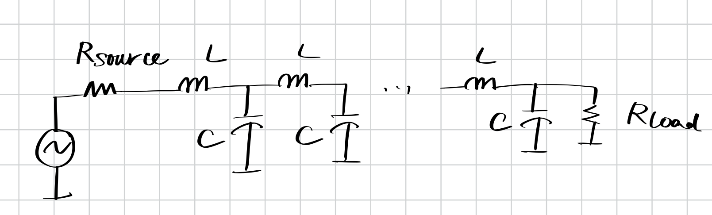
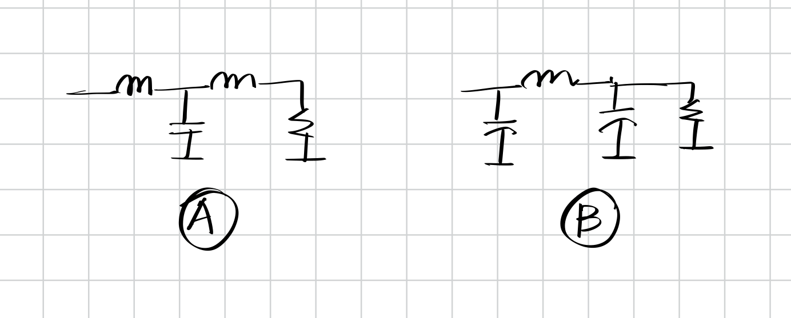

我们在前三节中讨论了巴特沃斯滤波器以及两种切比雪夫滤波器的特性以及计算方法，但是我们还不知道应该怎么样使用电路元件制造这些对应的滤波器。从这一节开始，我们将从理论部分逐渐过渡到电路实现部分。

## 1. 双端LC滤波器(Doubly-Terminated LC Filter)

### 阻抗匹配(Impedance Matching)

在早期的电话通信系统中，我们想要拥有最大的功率传输效率。根据欧姆定律，我们知道阻抗匹配可以使得信号的功率最大化。如果读者有关于微波电路的基础知识，那么你应该知道仅仅使得输入和输出端实阻抗相等是不够的，因为输入和输出端的感抗元件会修改相位。

如果说输入端和输出端的阻抗是实数，那么令它们相等（阻抗匹配）就可以实现最大功率传输：

$$P = \frac{V^2}{4R}$$

如果说输出端和输入端的阻抗是复数，那么我们需要让输入端和输出端的阻抗满足共轭关系。如果我们无法实现共轭关系，那么我们需要让输入端和输出端的阻抗满足模长相等。

要使得两端阻抗成共轭关系，我们需要在输入端和输出端都引入一个**匹配网络(Matching Network)** 。匹配网络的作用是将输入端和输出端的阻抗变换为相同的共轭阻抗。一般来说，匹配网络会优先使用感抗元件（电容，电感）而非阻抗元件（电阻），因为感抗元件只消耗感性功率而不消耗有功功率，因此不消耗实际能量。

需要注意的是，阻抗匹配不一定能实现最大功率传输。最大功率传输的条件是输入端和输出端的阻抗完全相等，而阻抗匹配仅仅是使得输入端和输出端的阻抗模长相等。

### 双端LC滤波器的基本结构

滤波器的建立和匹配网络十分相似。我们把下面的电路称为**双端LC滤波器(Doubly-Terminated LC Filter)** ，也被称为**双端LC标准型(Doubly-Terminated LC Canonical Form)** ，或者**双端LC梯形网络(Doubly-Terminated LC Ladder)** 。它的基本结构如下：

使用双端LC滤波器的标准形式，我们可以实现任何全极点滤波器。需要注意的是，感抗元件的数量对应于滤波器的极点数量——对于全极点滤波器而言，这就是系统的阶数。

那么接下来的问题就是，假如说我们给定一个滤波器的传递函数，我们要如何设计双端LC滤波器的感抗元件呢？直觉上来说，我们可以建立这个二端网络的阻抗矩阵：

$$Z = \begin{bmatrix}
Z_{11} & Z_{12} \\
Z_{21} & Z_{22}
\end{bmatrix}$$

然后我们使用分压原理来计算输入端和输出端的阻抗，从而计算出传递函数。然而这样做十分复杂，因此我们需要一个更简单的方法。

### 无损网络(Lossless Network)，功率传输，反射系数（Reflection Coefficient）

如果说一个网络仅由感抗元件组成，这个网络也被称为**无损网络(Lossless Network)** ，因为不会有任何的功率耗散在网络里。

我们将传输给负载电阻的功率定义为$P_a$，那么由于无损网络的特性，我们可以列出以下等式：

$$\begin{aligned}
P_a &= \frac{V_o^2}{Z_0} = \frac{|H(j\omega)|^2 V_i^2}{Z_0} \\
&= \frac{V_i^2}{|Z_0 + Z_{in}(s)|^2}\Re(Z_{in}(s))
\end{aligned}$$

我们的目标是找到$Z_{in}(s)$，使得上述等式成立。我们知道，最大功率在输入端和输出端的阻抗相等时实现，此时输出端的功率为：

$$P_{max} = \frac{V_i^2}{4Z_0}$$

如果我们将最大传输功率与实际传输功率取差：

$$\begin{aligned}
P_{max} - P_a &= \frac{V_i^2}{4Z_0} - \frac{V_i^2}{|Z_0 + Z_{in}(s)|^2}\Re(Z_{in}(s)) \\
&= \frac{V_i^2}{4Z_0} - \frac{V_i^2(Z_{in}+ Z_{in}^*)}{2(Z_0 + Z_{in})(Z_0 + Z_{in}^*)} \\
&= \frac{V_i^2}{4Z_0} \frac{Z_0^2 - Z_0Z_{in}^* - Z_{in}Z_0 + Z_{in}Z_{in}^* }{(Z_0 + Z_{in})(Z_0 + Z_{in}^*)} \\
&= \frac{V_i^2}{4Z_0} \frac{(Z_{in} - Z_0)(Z_{in}^* - Z_0)}{(Z_0 + Z_{in})(Z_0 + Z_{in}^*)}
\end{aligned}$$

如果我们定义：

$$\Gamma = \frac{Z_{in} - Z_0}{Z_{in} + Z_0}$$

那么我们可以得到：

$$P_{max} - P_a = \frac{V_i^2}{4Z_0} \Gamma \Gamma^* = \frac{V_i^2}{4Z_0} |\Gamma|^2$$

我们称$\Gamma$为**反射系数(Reflection Coefficient)** ，它表示了输入端和输出端的阻抗不匹配程度。反射系数的模长越大，表示输入端和输出端的阻抗越不匹配。当阻抗完全匹配时，反射系数为0，此时功率传输最大。

$$P_a = (1 - |\Gamma|^2) P_{max}$$

回顾我们的功率传输，

$$\frac{V_i^2}{4Z_0} (1 - |\Gamma|^2) = \frac{V_i^2 |H(j\omega)|^2}{Z_0}$$

我们可以得到：

$$|H(j\omega)|^2 = \frac{1 - |\Gamma|^2}{4}$$

由于$|\Gamma| > 0$，因此这种低通滤波器的最大DC增益只能达到$\frac{1}{2}$。

### 通带，阻带与反射系数

比较上述反射系数与幅度响应的关系，我们可以得出以下结论：

- **在通带中** ，反射系数的模长$|\Gamma|$接近0，因此幅度响应$|H(j\omega)|$接近1。
  - 此时，全部的功率都传输到负载电阻上。
- **在阻带中** ，反射系数的模长$|\Gamma|$接近1，因此幅度响应$|H(j\omega)|$接近0。
  - 此时，全部的功率都被反射回输入端，没有传输到负载电阻上。

这符合我们的直觉，因为在通带中，信号可以通过滤波器传输到负载，而在阻带中，信号被滤波器阻挡，无法传输到负载。

### 例：三阶巴特沃斯滤波器

让我们来看一个具体的例子。我们设计这样一个双端LC滤波器，使得它的传递函数为三阶巴特沃斯滤波器。我们归一化截止频率与阻抗。

首先我们可以列出以下方程：

$$|H(j\omega)|^2 = \frac{1}{1 + \omega^6} \cdot \frac{1}{4} = \frac{1 - |\Gamma|^2}{4}$$

那么，

$$|\Gamma|^2 = \frac{\omega^6}{1 + \omega^6} = \Gamma(j\omega)\Gamma(-j\omega)$$

因此我们可以推得，

$$\Gamma(s) = \frac{s^3}{(s+1)(s^2 + s + 1)}$$

使用归一化条件$Z_0 = 1$，我们可以求得输入阻抗：

$$Z_{in}(s) = \frac{2s^3 + 2s^2 + 2s + 1}{2s^2 + 2s + 1}$$

现在让我们来思考一个问题。以下的两个网络都是三阶标准型，我们应该选择哪一个来实现我们的滤波器？

答案应该是左边的网络，因为当频率趋近于无穷大时，我们希望阻抗趋近于无穷大，而只有左边的网络才能满足这个条件。右边的网络在高频时的阻抗趋近于0，这会导致信号被短路。

在$s \to \infty$时，阻抗大小趋近于1，因此可以求得第一个电感的值为1H。移除掉这个电感，再对接下来的电路进行同样的分析，我们可以得到第二个电容的值为2F，第二个电感的值为1H，而最后的负载电阻值为1Ω，正如我们所期望的。

### 小结

在这个例子中，我们展示了如何使用双端LC滤波器的标准形式来实现一个三阶巴特沃斯滤波器。我们通过计算反射系数和输入阻抗来设计滤波器的感抗元件，并确保在高频时阻抗趋近于无穷大。这个方法依然可以用在第一类切比雪夫滤波器的设计上，但是对于第二类切比雪夫滤波器，由于有限的零点，我们需要引入**谐振回路(Resonant Tank)**  来实现有限的零点。我们将在下一节中讨论这个例子。
