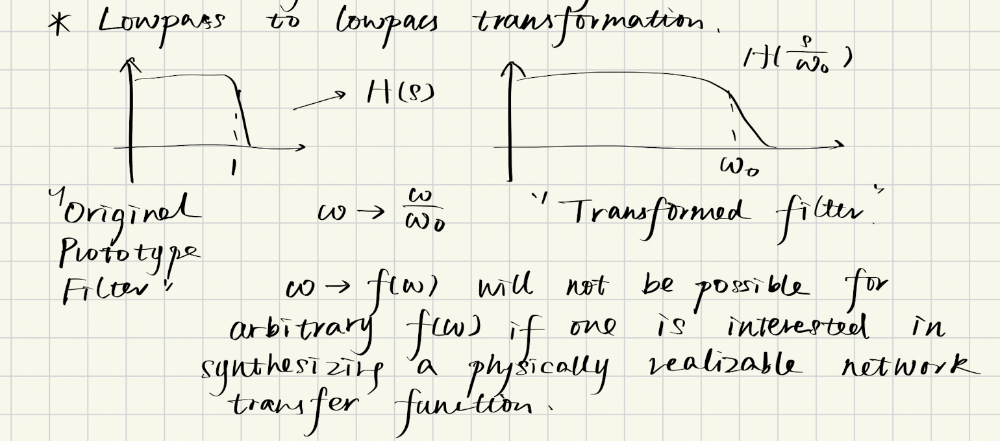
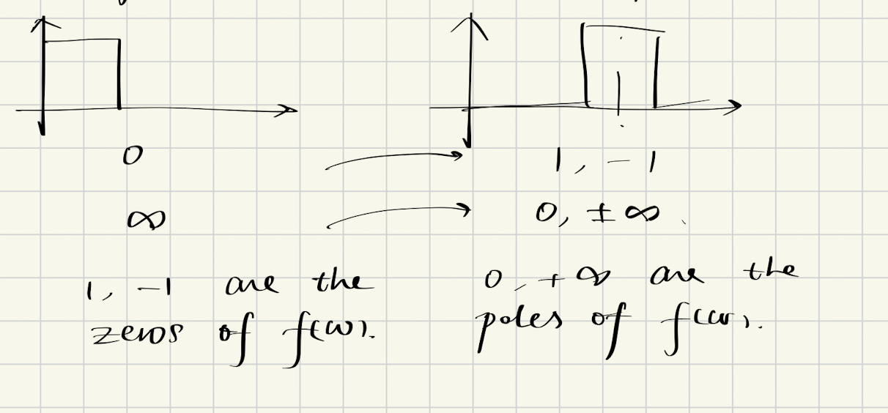
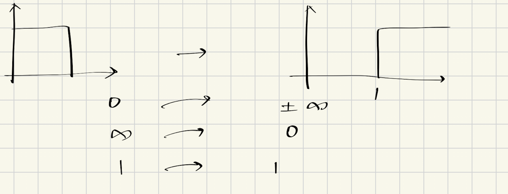
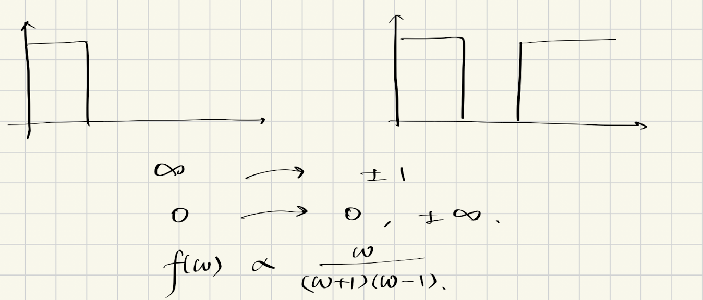

到目前为止，我们的所有讨论都是基于低通滤波器的。我们讨论了：
- 如何进行理想低通滤波器的近似
- 基本的网络合成方法：使用双端LC滤波器的标准形式来设计全极点滤波器，以及第二类切比雪夫滤波器

从这一节开始，我们讨论如何将一个低通滤波器转换为其他类型的滤波器，比如高通、带通和带阻滤波器。也就是说，在以后的工程实践中，我们并不需要从头开始设计每一种滤波器，而是可以通过频率变换，将一个低通原型滤波器转换为其他类型的滤波器。

## 1. 频率变换的基础：缩放操作

### 1.1 低通缩放(Scaling)

我们知道最基本的频率变换：**缩放(Scaling)** 。我们之前所有设计的滤波器的截止频率都是1 rad/s，然而在现实生活中，这个值显然不现实。对于一个吉他的效果器而言，我们可能需要的截止频率是1000 rad/s。我们可以通过缩放来实现这个目标。

假如我们原来的传递函数是$H(s)$，只要把$s$替换为$s/\omega_0$，就可以得到一个新的传递函数$H(s/\omega_0)$，其中$\omega_0$是我们想要的截止频率：

$$s \rightarrow \frac{s}{\omega_0} \quad \therefore \quad H(s) \rightarrow H\left(\frac{s}{\omega_0}\right)$$

使用缩放操作，我们有以下关系：

$$\omega \rightarrow \frac{\omega}{\omega_0}, \quad j\omega \rightarrow j\frac{\omega}{\omega_0}, \quad s \rightarrow \frac{s}{\omega_0}$$

### 1.2 元件阻抗的变换

我们可以看到，使用缩放操作，我们只需要变换原网络里的角频率。哪些元件的值里包括了角频率？答案是只有感性元件有这个特征，因此我们有下列表格展示在缩放情况下的阻抗变换：

| 元件类型 | 原阻抗 | 缩放后的阻抗 | 评论 |
|----------|--------|--------------|------|
| 电阻(R) | $R$ | $R$ | 无变化 |
| 电感(L) | $sL$ | $\frac{sL}{\omega_0}$ | 除以$\omega_0$ |
| 电容(C) | $\frac{1}{sC}$ | $\frac{\omega_0}{sC}$ | 乘以$\omega_0$ |
| 主动元件(G) | $G$ | $G$ | 无变化 |

** 重要结论：只有感性元件的阻抗在缩放时会发生变化。**

这种低通到低通的变换非常简单，并且是线性操作。然而很不幸，如果我们要将一个低通滤波器转换为高通滤波器，转换函数将不会是一个线性函数。

一个值得注意的事实是，感性元件在经过变换之后，依然是感性元件。由于感性元件也是无损耗的，因此我们想要保留这个特性，从而保证在变换之后的滤波器依然是无损耗的。

## 2. 频率变换的基本原则

频率变换不是想怎么变就能怎么变的。假如我们有以下的变换映射：

$$\omega \rightarrow f(\omega)$$

那么，$f(\omega)$必须满足以下条件：

1. ** 零点映射**：$\omega = 0$必须移动到$f(\omega) = 0$，也就是说$\omega$的零点必须移动到$f(\omega)$的零点
2. ** 极点映射**：$\omega = \infty$必须移动到$f(\omega) = \infty$，也就是说$\omega$的极点必须移动到$f(\omega)$的极点
3. ** 截止频率映射**：$\omega$的截止频率也必须移动到$f(\omega)$的截止频率

### 2.1 带通滤波器的变换

根据上述原则，我们可以得知如果我们要把一个低通滤波器变成一个带通滤波器，我们需要满足以下条件：

1. ** 零点映射**：低通滤波器的零点必须移动到带通滤波器的零点，即$\omega = 0 \rightarrow f(\pm 1) = 0$
   - 我们同样做了归一化假设
2. ** 极点映射**：低通滤波器的极点必须移动到带通滤波器的极点，即$\omega = \infty \rightarrow f(0, \pm \infty) = \infty$

因此，我们可以得出结论，转换函数至少需要拥有如下形式：

$$f(\omega) \propto \frac{(\omega + 1)(\omega - 1)}{\omega} = \frac{\omega^2 - 1}{\omega}$$

注意到这只是一个成正比的关系，因为我们并不知道转换函数是否有其他的因子。

### 2.2 高通滤波器的变换

同样的，对于高通滤波器而言，我们需要满足以下条件：

1. ** 零点映射**：低通滤波器的零点必须移动到高通滤波器的极点，即$\omega = 0 \rightarrow f(\infty) = \infty$
2. ** 极点映射**：低通滤波器的极点必须移动到高通滤波器的零点，即$\omega = \infty \rightarrow f(0) = 0$
3. ** 截止频率映射**：高通滤波器的截止频率满足$f(1) = 1$

因此，我们可以得出结论，转换函数至少需要拥有如下形式：

$$f(\omega) \propto \frac{1}{\omega}$$

再次注意到这只是一个成正比的关系，因为我们并不知道转换函数是否有其他的因子。

### 2.3 带阻滤波器的变换

同样的，对于带阻滤波器而言，我们需要满足以下条件：

1. ** 零点映射**：低通滤波器的零点必须移动到带阻滤波器的极点，即$\omega = 0 \rightarrow f(\pm 1) = \infty$
2. ** 极点映射**：低通滤波器的极点必须移动到带阻滤波器的零点，即$\omega = \infty \rightarrow f(0, \pm \infty) = 0$

因此，我们可以得出结论，转换函数至少需要拥有如下形式：

$$f(\omega) \propto \frac{\omega}{(\omega + 1)(\omega - 1)} = \frac{\omega}{\omega^2 - 1}$$

我们需要做最后一次提示，注意到这只是一个成正比的关系，因为我们并不知道转换函数是否有其他的因子。

## 2.4 可实现性条件

除了要满足上述映射要求之外，滤波器的基本稳定性要求也必须得到满足。也就是说，滤波器的极点必须在左半平面内，否则滤波器就会不稳定。由于传递函数的倒函数也是一个有效的传递函数，因此这个要求也必须满足于零点上。

** 稳定性要求**：
- 所有极点必须位于左半平面
- 所有零点也必须位于左半平面或虚轴上
- 变换后的滤波器必须保持因果性和稳定性

## 3. 变换函数的性质总结

通过以上分析，我们可以总结出各种滤波器变换的基本形式：

| 滤波器类型 | 变换函数形式 | 零点-极点映射特征 |
|------------|--------------|-------------------|
| 低通→低通 | $s/\omega_0$ | 线性缩放 |
| 低通→高通 | $1/\omega$ | 零极点互换 |
| 低通→带通 | $(\omega^2-1)/\omega$ | 一个极点/零点分裂为两个 |
| 低通→带阻 | $\omega/(\omega^2-1)$ | 一个极点/零点分裂为两个 |

最后一次提示，以上变换函数都是成正比的关系，实际应用中可能需要根据具体情况添加其他因子。但是在下一节中，我们将证明其他因子只会是一个常数。

