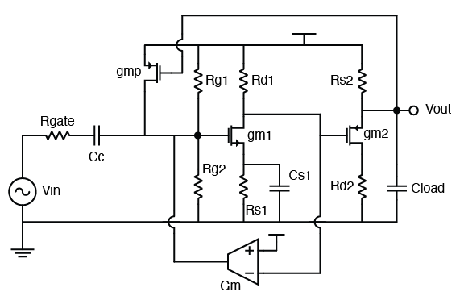
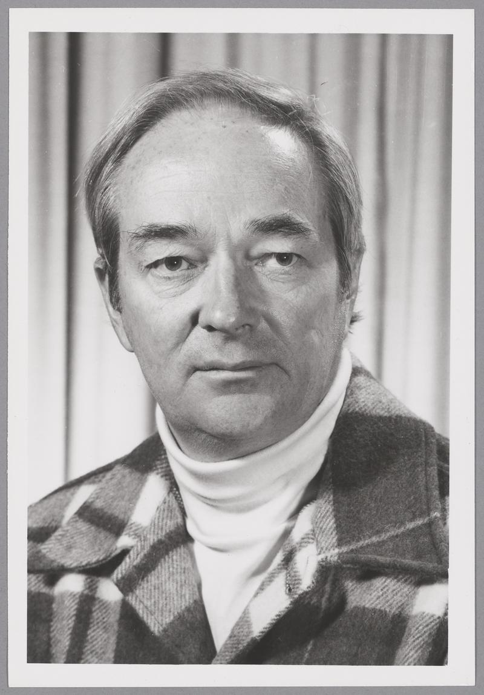
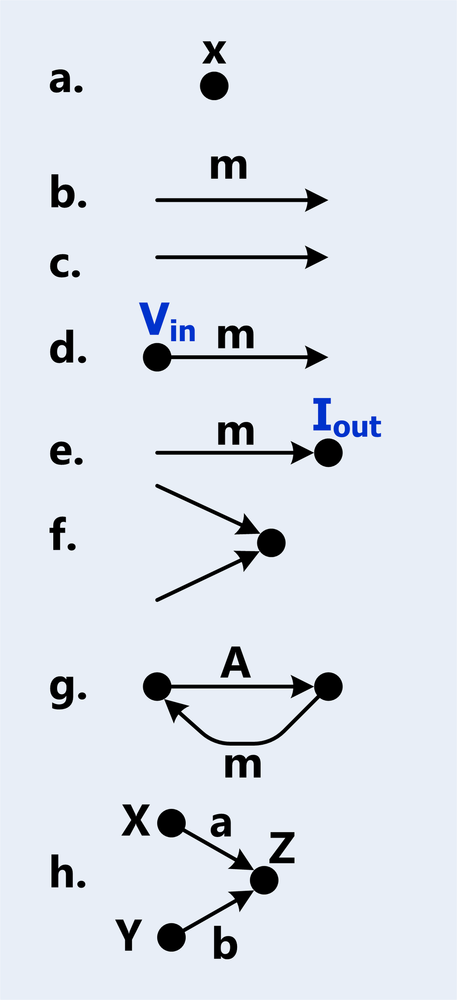
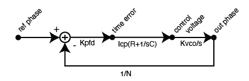
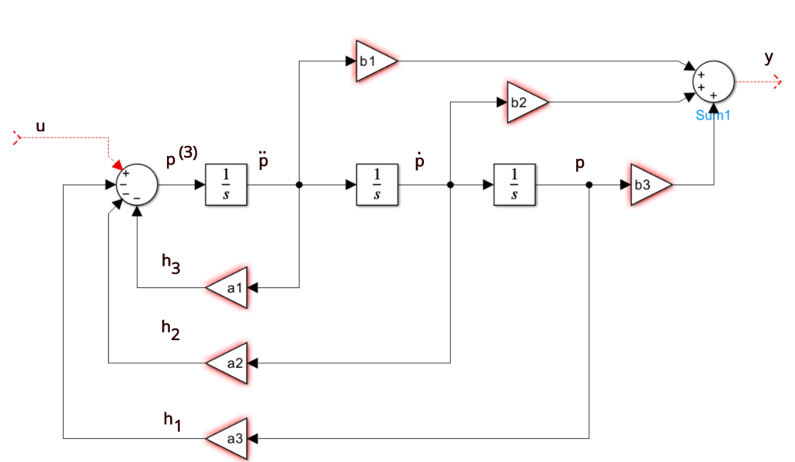
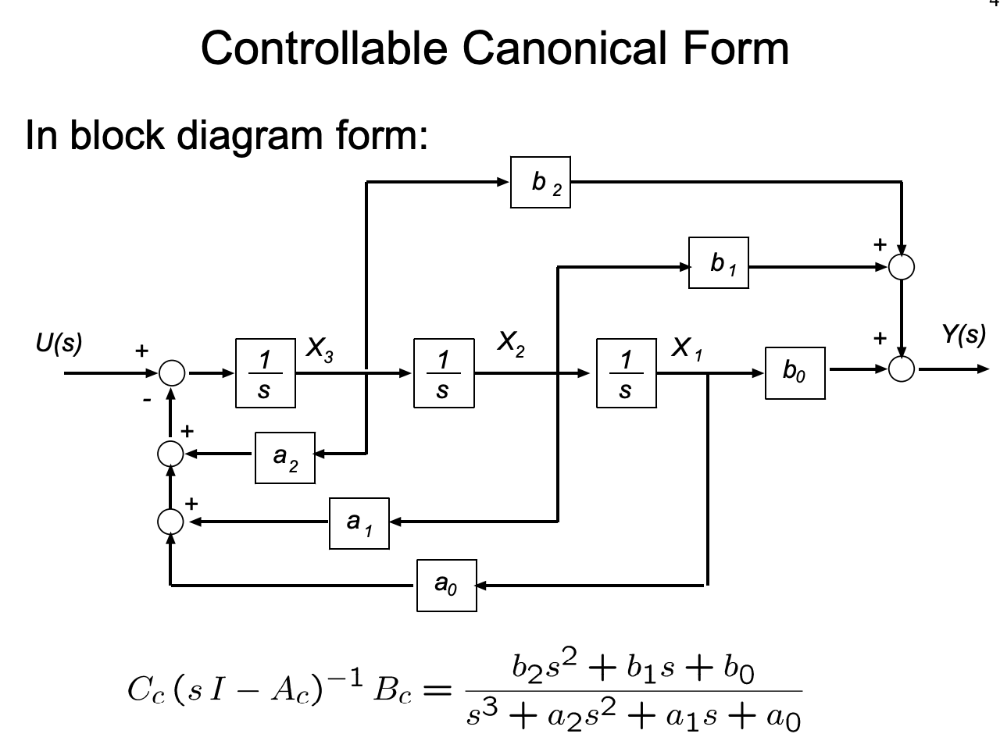
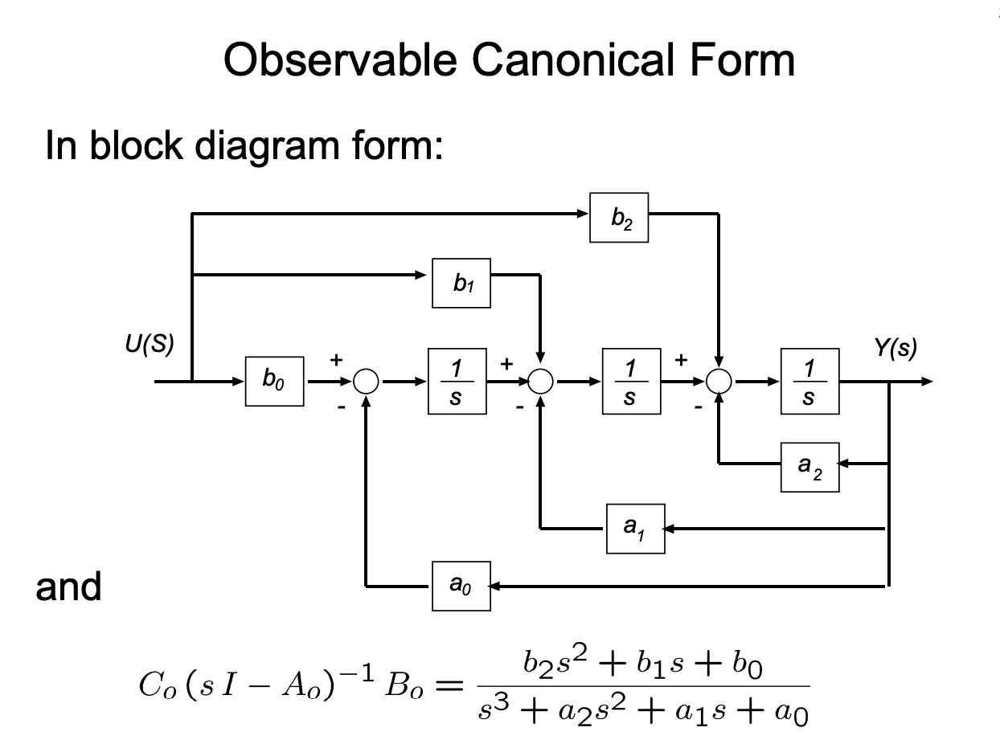
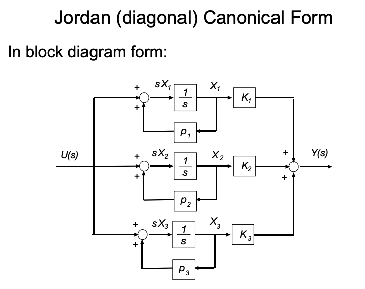
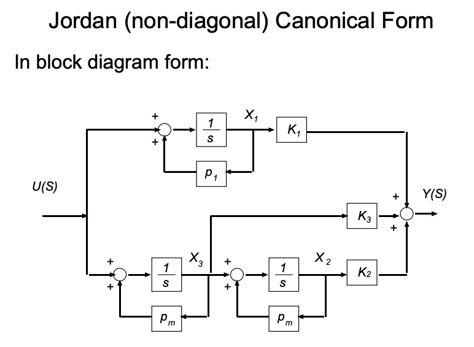

## Introduction

Pop quiz: what's the transfer function $H(s) = V_{out} / V_{in}$ in the following circuit?

Assumptions:
- $C_c$ is a big coupling capacitor.
- No channel-length modulation. 
- You don't have to solve for DC, all small signal parameters are given. Don't assume unspecified parameters, for example $r_o$, $C_g$, etc.
- The circuit is linear.

OK this circuit does look a bit intimidating. For entry-level analog circuit class takers, they might take out pencil to work through the analysis, but it's super tedious, time consuming and error-prone. 

Look at the circuit, what is the main reason that makes analysis difficult? Feedback. Not just one feedback path, there are two feedbacks from each of the two stages rendering the overall analysis not so straightforward. However, we are going to introduce a very elegant mathematical tool to deal with all these kinds of closed-loop structures.

## Mason's Gain Formula

Samuel Jefferson Mason was born in 1921. As a distinguished electronics engineer, his most famous scientific contributions are Mason's invariant and Mason's rule, or Mason's gain formula, both named after him.

Mason's gain formula is used to find the transfer function of a closed-loop system. A closed loop system doesn't need to contain only one loop; it could contain multiple loops, and they can even interact with each other. Conventional algebraic way to find the transfer function usually requires solving complex simultaneous systems, but Mason's gain formula provides an easy way to find it.

Mason's gain formula is particularly suitable for a system that can be described using a Signal Flow Graph.

### Signal Flow Graph (SFG)

A Signal Flow Graph (SFG) is a graphical representation of a system. As the name suggests, an SFG is a directed graph, meaning it has the following components:
- **Node**: a node is a vertex that represents a variable in a system.
- **Branch**: a branch is a directed edge that represents a transfer function between two nodes. It has a linear gain. If the gain is 1, we don't annotate it on the SFG.
- **Input/Output**: Input / Output nodes are special nodes where we use to denote the transfer function's departure and arrival points.
- **Addition**: Two signals could be added together, given SFG is targeting linear systems.

Now, with these simple definitions, we are able to construct more complex notations + structures:
- **Path**: a path is a sequence of branches that connect nodes in the graph, such that no node is visited more than once.
  - **Forward Path**: a forward path is a path from the input node to the output node.
  - **Path Gain**: the product of the gains of all branches in a path.
- **Loop**: a loop is a path that starts and ends at the same node. A loop is a specific type of path.
  - **Loop Gain**: the product of the gains of all branches in a loop.

#### Example: Type 2 PLL
Shown below is a type-2 PLL: 

We are able to see 5 paths here and a simple loop. We defined 4 nodes, with 1 input node and 1 output node.

### The Formula
Mason's Gain Formula states the following:

> **Mason's Gain Formula**: 
> 
> $$H(s) = \frac{\sum_{k=1}^{N} P_k \Delta_k}{\Delta}$$
>
> where:
> - $N$ is the number of forward paths from input to output
> - $P_k$ is the path gain of the $k$-th forward path
> - $\Delta$ is the determinant of the system: $\Delta = 1 - \sum L_i + \sum L_i L_j - \sum L_i L_j L_k + \ldots$
>   - $\sum L_i$ is the sum of all individual loop gains
>   - $\sum L_i L_j$ is the sum of products of all pairs of non-touching loops
>   - $\sum L_i L_j L_k$ is the sum of products of all triplets of non-touching loops
>   - and so on...
> - $\Delta_k$ is the cofactor of the $k$-th forward path, obtained by removing all loops that touch the $k$-th path from $\Delta$

## Examples

### A Type 2 Charge Pump PLL
Let's take the type-2 PLL system shown above for example.

In this example, there is 1 single loop, and only 1 forward path from input to output. Therefore, $N=1$, and:

$$\begin{align}
\Delta &= 1 - L_1 = 1 + K_{PFD}I_{CP}(R + 1/sC)K_{VCO}/s / N \\
\Delta_1 &= 1 \\
\displaystyle \Sigma_{k=1}^{N}P_k \Delta_k &= K_{PFD}I_{CP}(R + 1/sC)K_{VCO}/s
\end{align}$$

Bear in mind that $\Delta_1 = 1$ because there is only one loop, and it does touch the forward path, therefore we remove the only contributing loop gain from $\Delta$.

Thus, combining the terms together, we have the expression for the closed loop gain:

$$
H(s) = \frac{K_{PFD}I_{CP}(R + 1/sC)K_{VCO}/s}{1 + K_{PFD}I_{CP}(R + 1/sC)K_{VCO}/s / N}
$$

We realize that the loop gain is large when frequency is low, the loop gain dominates and $H(s) = N$, meaning the low-frequency phase noise of the PLL will be the reference times $N^2$. At high frequency, the loop gain dies out and $H(s) = 0$. Therefore the reference to output phase transfer function is a low-pass filter.

### A Triple Integrator System
Now, let's compute the transfer function of the SISO system below:

We notice that there are 3 loops and 3 forwarded paths. Luckily, they all touch each other, which makes our calculation very simple.

$$
\begin{cases}
\Delta = 1 + a_1/s + a_2/s^2 + a_3/s^3 \\
p_1 = b1/s  \\
\Delta_1 = 1 \\
p_2 = b2/s^2 \\
\Delta_2 = 1 \\
p_3 = b3/s^3 \\
\Delta_3 = 1
\end{cases}
$$
Combining all the terms, we have

$$ \begin{align}
H(s) &= \frac{b_1/s + b_2/s^2 + b_3/s^3}{1 + a_1/s + a_2/s^2 + a_3/s^3} \\
&= \frac{b_1 s^2 + b_2 s + b_3}{s^3 + a_1 s^2 + a_2 s + a_3}
\end{align}
$$

## Canonical Forms
Doesn't the last example have a very regular transfer function? This is actually intended. 

In a control system modeled in time domain, we have our system defined using state-space model:
$$
\begin{align}
\dot{x}(t) &= Ax(t) + Bu(t) \\
y(t) &= Cx(t)
\end{align}
$$
and we know that, if we perform Laplace transform, while assuming a 0 initial condition, we have
$$ sX(s) = AX(s) + BU(s) $$
Therefore, by algebraic manipulation, we have
$$ Y(s)/U(s) = C(sI - A)^{-1}B $$
Which is the transformation between state space model to transfer functions.

Now, there could be only one transfer function for a state space model, but there could be infinite state space models for one simple transfer function. The general rule of thumb is that, the number of poles in a transfer function regulates the number of states in the corresponding state space model, because we need that many number of integrators. However, we could create more states (but those come with either constraints, or are redundant, meaning linearly independent of the pre-existing states). 

There are some state space models that are different from generic ones, if we generate from a transfer function. Here are some of them:

### Controllable Canonical Form

We already encounter the controllable canonical form in the previous example. 

Controllable canonical form is a specific type of form because the generated state space model is always controllable. The state space model is given by:

$$
\begin{align}
\frac{d}{dt}X &= \begin{pmatrix}
0 & 1 & 0 & 0 & \ldots & 0 & 0 \\
0 & 0 & 1 & 0 & \ldots & 0 & 0 \\
\vdots & \vdots & \vdots & \vdots & \ddots & \vdots & \vdots \\
0 & 0 & 0 & 0 & \ldots & 1 & 0 \\
-a_0 & -a_1 & -a_2 & -a_3 & \ldots & -a_{n-1} & -a_n
\end{pmatrix}X + \begin{pmatrix}
0 \\
0 \\
\vdots \\
0 \\
1
\end{pmatrix}U \\
Y &= \begin{pmatrix}
b_0 & b_1 & b_2 & \ldots & b_n
\end{pmatrix}X
\end{align}
$$

According to Rudolf Kalman, the controllability matrix of the controllability canonical form is always going to be full rank. That's why we call it controllable canonical form.

### Observable Canonical Form

Observability, the dual of controllability, also has its canonical form. Its state space model representation is given by:

$$
\begin{align}
\frac{d}{dt}X &= \begin{pmatrix}
0 & 0 & 0 & \ldots & 0 & -a_0 \\
1 & 0 & 0 & \ldots & 0 & -a_1 \\
0 & 1 & 0 & \ldots & 0 & -a_2 \\
0 & 0 & 1 & \ldots & 0 & -a_3 \\
\vdots & \vdots & \vdots & \ddots & \vdots & \vdots \\
0 & 0 & 0 & \ldots & 1 & -a_{n-1}
\end{pmatrix}X + \begin{pmatrix}
b_0 \\
b_1 \\
b_2 \\
b_3 \\
\vdots \\
b_{n-1}
\end{pmatrix}U \\
Y &= \begin{pmatrix}
0 & 0 & 0 & \ldots & 0 & 1
\end{pmatrix}X
\end{align}
$$

If you take a closer look, you'll notice that the observable canonical form is precisely the transpose of the controllable canonical form: $A_o = A_c^T$, $B_o = C_c^T$, and $C_o = B_c^T$. This is not a coincidence — it is a direct manifestation of the duality between controllability and observability. Taking the transpose of a state space realization preserves the transfer function, since
$$
H(s) = C(sI - A)^{-1}B = \left[ B^T (sI - A^T)^{-1} C^T \right]^T
$$
and the transfer function is a scalar for SISO systems, so the transpose is itself.

By the dual of Kalman's argument, the observability matrix of the observable canonical form is always full rank, which is why we call it the observable canonical form. Notice as well that, unlike the controllable form where the input coefficients $b_i$ are placed in the output matrix $C$, here they show up directly in the input matrix $B$. Each state $x_i$ accumulates a weighted contribution from $u(t)$ and feeds back through $-a_i$ to drive only the last state, which is then read out at the output. Reading the SFG above from right to left makes the structure obvious: it is the controllable canonical form with all arrows reversed.

### Diagonal Form and Jordan Form

The controllable and observable canonical forms are built around the coefficients of the polynomials $a_i$ and $b_i$. The Jordan form takes a different approach: instead of starting from the polynomial coefficients, we start from the *poles* of the transfer function. Performing partial fraction decomposition,

$$
H(s) = \frac{b_{n-1}s^{n-1} + \ldots + b_1 s + b_0}{(s - p_1)(s - p_2) \ldots (s - p_n)} = \sum_{i=1}^{n} \frac{r_i}{s - p_i}
$$

where $p_i$ are the poles and $r_i$ are the residues. Each first-order term $r_i/(s - p_i)$ corresponds to a single integrator with self-feedback $p_i$ and a gain $r_i$ at the output. The SFG above is exactly that — $n$ parallel branches, each with its own pole, all summed at the output.

Stacking these parallel branches into a state space model gives the diagonal Jordan form (assuming distinct poles):

$$
\begin{align}
\frac{d}{dt}X &= \begin{pmatrix}
p_1 & 0 & 0 & \ldots & 0 \\
0 & p_2 & 0 & \ldots & 0 \\
0 & 0 & p_3 & \ldots & 0 \\
\vdots & \vdots & \vdots & \ddots & \vdots \\
0 & 0 & 0 & \ldots & p_n
\end{pmatrix}X + \begin{pmatrix}
1 \\
1 \\
1 \\
\vdots \\
1
\end{pmatrix}U \\
Y &= \begin{pmatrix}
r_1 & r_2 & r_3 & \ldots & r_n
\end{pmatrix}X
\end{align}
$$

Because $A$ is diagonal, the states are completely decoupled — each $x_i$ evolves independently as $\dot{x}_i = p_i x_i + u$, and the output is just a weighted sum of these modes. This makes the Jordan form particularly useful for analysis: the eigenvalues of $A$ are read off the diagonal, so stability is immediate (all $\text{Re}(p_i) < 0$), and each mode's contribution to the output is exactly $r_i$.

When poles are repeated, $A$ is no longer fully diagonalizable. For a pole $\lambda$ with multiplicity $k$, the corresponding diagonal block becomes a Jordan block:

$$
J_k(\lambda) = \begin{pmatrix}
\lambda & 1 & 0 & \ldots & 0 \\
0 & \lambda & 1 & \ldots & 0 \\
\vdots & \vdots & \ddots & \ddots & \vdots \\
0 & 0 & 0 & \lambda & 1 \\
0 & 0 & 0 & 0 & \lambda
\end{pmatrix}
$$

The superdiagonal of 1's couples adjacent states within the block, which corresponds to terms of the form $r_{i,j}/(s - \lambda)^j$ in the partial fraction expansion. The overall $A$ matrix is still block-diagonal, with one Jordan block per distinct pole.

Unlike the controllable and observable canonical forms — which are guaranteed to be controllable / observable by construction — the Jordan form is only controllable and observable when *all* residues $r_i$ are nonzero and all poles are distinct. A zero residue corresponds to a pole-zero cancellation in $H(s)$, which means a mode that is either uncontrollable or unobservable (or both). In that sense, the Jordan form is the most honest of the three: it makes hidden modes visible rather than burying them in the structure.

### Modified Form
It becomes even trickier if the original system's poles are not on the real axis, but contains complex conjugate pairs. In this case, we can either sub in diagonal form with the complex entries, or we use what's called the "modified form".

The **modified Jordan form** (also known as the *real Jordan form*) keeps the state space model entirely real-valued by replacing each pair of complex conjugate poles $p_i = \sigma \pm j\omega$ with a single $2 \times 2$ real block on the diagonal of $A$:

$$
\begin{pmatrix}
\sigma + j\omega & 0 \\
0 & \sigma - j\omega
\end{pmatrix} \quad \longrightarrow \quad \begin{pmatrix}
\sigma & \omega \\
-\omega & \sigma
\end{pmatrix}
$$

This block is similar to the diagonal complex form via the change of basis
$$
T = \frac{1}{\sqrt{2}}\begin{pmatrix} 1 & 1 \\ j & -j \end{pmatrix},
$$
so the transfer function is preserved. Concretely, for a system whose poles consist of $m$ real poles $\lambda_1, \ldots, \lambda_m$ and $\ell$ complex conjugate pairs $\sigma_k \pm j\omega_k$, the modified form is

$$
A = \begin{pmatrix}
\lambda_1 & & & & & & \\
& \ddots & & & & & \\
& & \lambda_m & & & & \\
& & & \sigma_1 & \omega_1 & & \\
& & & -\omega_1 & \sigma_1 & & \\
& & & & & \ddots & \\
& & & & & & \begin{smallmatrix} \sigma_\ell & \omega_\ell \\ -\omega_\ell & \sigma_\ell \end{smallmatrix}
\end{pmatrix}
$$

The eigenvalues of each $2 \times 2$ block are exactly $\sigma_k \pm j\omega_k$, so spectral information is unchanged — we have only traded a complex diagonal representation for a real block-diagonal one. This is the form most software packages return by default, since real arithmetic is cheaper and avoids the bookkeeping of conjugate pairs. Repeated complex poles generalize to real Jordan blocks by replacing each scalar entry of the complex Jordan block with the corresponding $2 \times 2$ real block, and each superdiagonal $1$ with a $2 \times 2$ identity.

## Where were we?
We talked a lot about the famous Mason's gain formula, and several canonical forms that we can use to represent linear time-invariant systems. Now going back to the original question: what's the closed loop gain of the original system? 

Well, we do realize that the system had two loops, but they do touch; and the system has only one forward path. That makes our computation significantly easier.

Let's use some notations here. Let's denote the forward gain as $F_1, F_2$ and the loop gains as $L_1, L_2$. From basic analog circuit theory, we have:
$$
\begin{align}
F_1 &= -\frac{g_{m1}R_{d_1}}{1 + g_{m1}R_{d_1}||1/sC_1} \\
F_2 &= \frac{g_{m2}R_{s2}}{1 + g_{m2}R_{s2}} \\
L_1 &= (G_m R_{gate} || R_{g1} || R_{g2} F_1) \\
L_2 &= (-g_{mp} R_{gate} || R_{g1} || R_{g2} ) F_1 F_2
\end{align}
$$
And finally, our closed loop gain:

$$
\frac{V_{out}}{V_{in}}(s) = \frac{F_1F_2}{1 + L_1 + L_2}
$$

This looks a lot faster compared to manually breaking down all expressions. 

---

I would like to point out at the end of this article that the original circuit is unstable, because both loop gains are positive. Unless the loop determinant is strictly positive in real part, the circuit will be unstable.