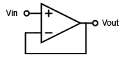
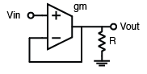
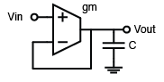
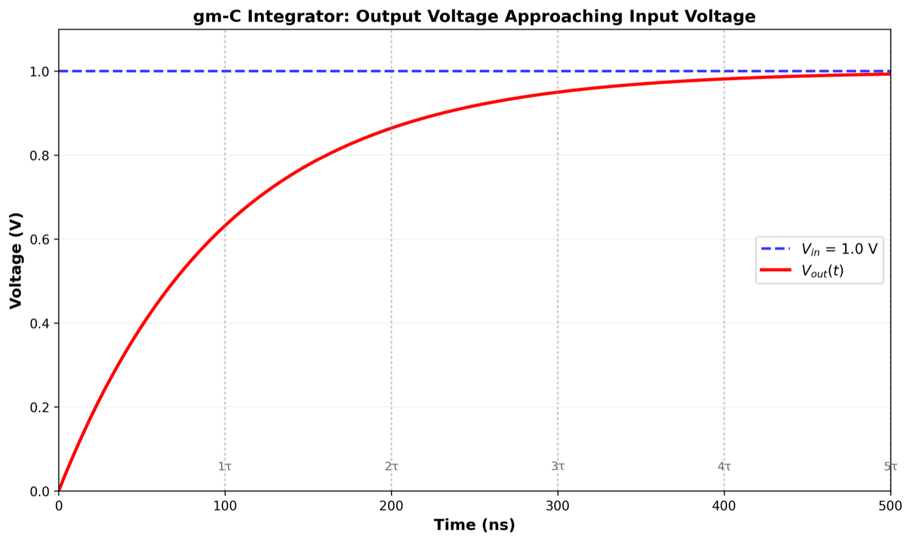
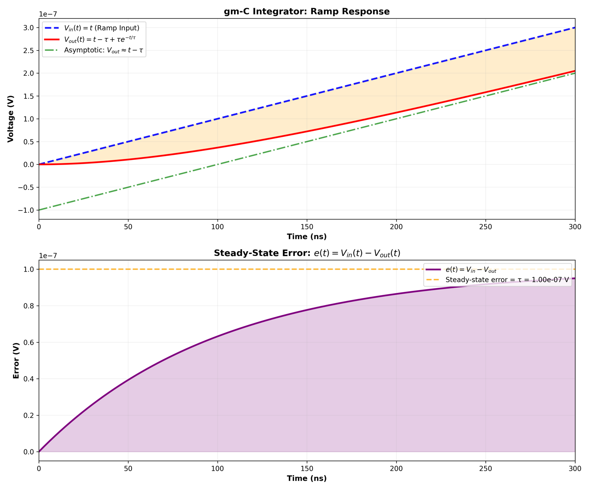

## Introduction

I started to have the very first question regarding "steady-state error" when I was a sophomore. I still recall the first class in EE2002: Analog Electronics when the professor introduced the very first Operational Amplifier, and here is what he said:
> "An Operational Amplifier, or an OpAmp, is a circuit that has infinite gain, infinite input impedance, and 0 output impedance."

I was very confused back then. Out from all the 3 properties, the most counterintuitive one was the "infinite gain" property. I can still understand the engineering approximation of infinite input impedance due to CMOS nature, and 0 output impedance if you treat the output as a current source, but infinite gain doesn't make any sense. For the next few classes, I learned that infinite gain of the OpAmp allows feedback structure to kick in, so that it can provide a gain per the feedback impedance structure.

However, I feel that something is off here but I can't quite put my finger on it. I didn't quite get the correct terminology until I turned into a junior when I was taking EE3019: Integrated Electronics when we were introduced feedback in a more well-defined way, and I become aware that there is a term called "steady-state error" that defines the difference between the desired settling value versus the actual settled value. I feel like, yes, this is the correct word I've been looking for.

I came across this once again when I started my PhD and started to design what's called "Phase-Locked Loops (PLLs)", a specific feedback structure that's used to amplify a clean clock. I came across two different terms now: *Type-1 and Type-2 PLLs*. (I doubt whether a lot of PLL designers can actually tell the difference between the two). Interestingly enough, the textbook, nor the slides talk anything about why it's named type-1 or type-2, as if it's just a naming convention. 

I wasn't 100% clear on this matter until I took MEC237: linear control where I was introduced the book: *Control System Engineering* by Norman Nise, and looking into the book actually helped me understand the entire steady-state error theory. 

## The Problem Setup

Let's go back and give the problem intuition. Suppose we have an OpAmp, and we would like to use it as a voltage follower, so we configure it like it's a unit buffer:

Elementary analog circuit professor will tell you that because an ideal OpAmp has infinite gain, and it will always make sure both inputs are equal to each other. 
**WRONG**. 
There are at least two very hand-wavy explanation here:
1. The assumption of infinite gain is an idealization that doesn't hold in practice.
2. The infinite gain assumption also doesn't explain why it will make two inputs equal to each other.

In reality, the OpAmp's gain depends on the transconductance gain $g_m$ and the loading impedance $R$, and we define our open loop gain to be
$$ A = g_m R$$

For the OpAmp connected in the abovementioned way, the small signal relationship between the input and output is given by:

$$ V_{out} = A(V_+ - V_-) $$

where $V_+$ and $V_-$ are the voltages at the non-inverting and inverting inputs, respectively.

Now we try to use that relationship to analyze the behavior of the unit buffer. We realize that here we have  $V_- = V_{out}$, so solving the equation we have:

$$
 V_{out} = A(V_{in} - V_{out}) \\
 V_{out} = \frac{A}{1+A} V_{in}
$$

Now, if we find the transfer function from input to output, we identify

$$ H(s) = \frac{V_{out}(s)}{V_{in}(s)} = \frac{A}{1+A} \neq 1 $$

which basically means that the output is going to be just slightly smaller compared to the input. 

The reason we would like to make our amplifier to be infinite gain is that, if $A \to \infty$, we easily have

$$
H(s) = \lim_{A \to \infty} \frac{A}{1+A} = 1
$$

which means that the output will approach the input as the gain approaches infinity; otherwise there will be an error term between the real output versus the desired output, which is given by

$$ \begin{align}
\Delta V &= V_{out,desired} - V_{out,real} \\
&= V_{in} - V_{out,real} \\
&= V_{in} - \frac{A}{1+A} V_{in} \\
&= \frac{1}{1+A} V_{in}
\end{align}
$$
We can conclude two things from this expression:
1. The error is inversely proportional to $(1+A)$. The larger the gain is, the smaller the error is. However, if the gain is finite, no matter what non-zero input we see, the output can never achieve the desired value.
2. The larger the input voltage is, the larger the error is.

We call the error value between the desired and actual output the **steady-state error**. This phenomenon happens in closed-loop systems where we would like to control a control plant to approach a value that we want, in this example, the OpAmp is both a controller, a control plant and a detector. 

Now, the question becomes if we are able to reduce this error at all. 

## The Temporary Elixir: A Capacitor

The fix is surprisingly simple. We replace the resistor with a pure capacitor:

Let's do a time-domain calculation here first. Let's assume the output current of the $g_m$ cell is defined as $i$, then we have the relationship between $V_{out}$ and $i$:

$$
\begin{align}
i &= g_m (V_{in} - V_{out}) \\
i &= C\frac{dV_{out}}{dt}
\end{align}
$$

This ODE is not too hard to solve by hand. Assume a 0 initial condition on $V_{out}$, we have

$$
V_{out} = V_{in} (1 - e^{-\frac{g_m t}{C}})
$$

The assumption that we had initial condition 0 is equivalent to say that, if we provide a step response at the input, the output looks like an exponential decay curve that gradually goes to the input voltage. If we let $t \to \infty$, then we can easily see that
$$
\lim_{t \to \infty} V_{out} = V_{in}
$$
Nothing too fancy here; however, let's move one step further; how about it if my input is not a step function, but a ramp function?

## Ramp Response

Same circuit, but now my $V_{in} = t$. What happens to $V_{out}$? 
The ODE now becomes:

$$
\begin{align}
V_{in}(t) &= t \\
i &= g_m (V_{in}(t) - V_{out}) \\
i &= C\frac{dV_{out}}{dt}
\end{align}
$$

Again, we can solve the ODE system by direct integration. This gives us:
$$
V_{out}(t) = t - \tau + \tau e^{-\frac{t}{\tau}}
$$

where $\tau = \frac{C}{g_m}$.

Interestingly, if we now consider the steady-state error as a function of time, we have

$$
\begin{align}
e(t) &= V_{in}(t) - V_{out}(t) \\
&= t - (t - \tau + \tau e^{-\frac{t}{\tau}}) \\
&= \tau - \tau e^{-\frac{t}{\tau}} \\
&= \tau(1 - e^{-\frac{t}{\tau}})
\end{align}
$$

As $t \to \infty$, unfortunately the error doesn't die out, which would be what we have seen for a step response case. We show the plotting here as well:

In fact, we will see in later parts of this series, step input is called a "type-0" input, and ramp input is called a "type-1" input. The original R-loaded OpAmp is called a "type-0" system, and the C-loaded improved OpAmp is called a "type-1" system.

In the next section, we will introduce some very useful mathematics tool to help us analyze the system without solving the ODE every single time.