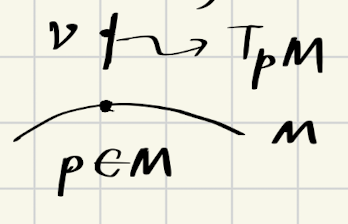
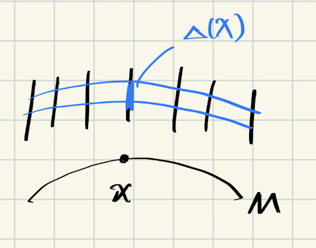

### More Facts about IO Linearization
We are now aware of how to perform input-output linearization. To summarize:
1. For an output with relative degree $r$, we are able to construct a feedback linearization mapping such that the input-output linearized system is of order $r$.
2. The remaining state will construct a "zero plane" $Z$ where the zero dynamics on the plane will determine the stability of the overall system.

Now, we can draw an obvious conclusion if the zero dynamic is indeed stable:

**Theorem**: If $z = 0$ is locally exponentially stable for the zero dynamics, $\dot{z} = q(0, z)$, then $u_{IO}, v$ locally exponentially stabilizes $x = 0$.

The proof is as follows:

**Proof**: The closed loop system is given by
$$
\begin{align}
\dot{\xi} &= A_{CL} \xi, A_{CL} = A - BK \\
\dot{z} &= q(\xi, z)
\end{align}
$$
where
$$
A_{CL} = \begin{pmatrix}
0 & 1 & 0 &\ldots & 0 \\
0 & 0 & 1 & \ldots & 0 \\
\vdots & \vdots & \vdots & \ddots & \vdots \\
-k_1 & -k_2 & -k_3 & \ldots & -k_r
\end{pmatrix}
$$
where $\Re{\lambda_i} < 0$ for all $i = 1, \ldots, r$.
If we linearize the system at $\xi = z = 0$, we get the following:

$$
\frac{d}{dt} \begin{pmatrix} \delta \xi \\ \delta z \end{pmatrix} = \begin{pmatrix}
A_{CL} & 0 \\
\frac{\partial q}{\partial \xi}(0, 0) & \frac{\partial q}{\partial z}(0, 0)
\end{pmatrix} \begin{pmatrix} \delta \xi \\ \delta z \end{pmatrix}
$$
The matrix is Hurwitz, thus the end of the proof.

We notice that the relationship between the new states $\xi$ and original states $x$ is such that
$$ \xi = T(x)$$
To verify if $T$ is a diffeomorphism, we introduce the following theorem:

**Inverse Function Theorem**: A function $T: \mathbb{R}^n \to \mathbb{R}^n$, $T \in C^1$ satisfies
$$ \frac{\partial T}{\partial x}(x_0) \neq 0 $$
is full rank, then $T^{-1}$ exists, and is continuous and differentiable.

Now let's connect IO linearization back to feedback linearization. It's not hard to see that if we can guarantee the zero dynamic to be stable, then the original system will be stable; the best way to make sure the zero dynamic is always stable is that the zero plane shrinks to just a point, and this is done if $r = n$. Therefore we have the following theorem:

**Isidori, chapter 4**: If a nonlinear system $\Sigma$ has a relative degree $r$ at $x_0$, then on the neighborhood of $x_0$, the functions 
$$ \{ h(x), L_fh(x), \ldots, L_f^{r-1}h(x) \} $$
are independent.
Then, we can conclude that, $\Sigma$ is feedback linearizible, if and only if $\exists y = h(x)$ such that the output has relative degree $r = n$.

In short, if the output of the system satisfies that the relative degree equals to the system degree, then the system is always linearizible. However, if the output has a relative degree smaller than the system degree, it's possible that we didn't pick a good output -- how do we know if a system can in fact be feedback linearizable? We'll have to introduce some more new concepts to answer the question.

### Introduction to Differential Geometry

Our audience may find themselves familiar with these concepts, if they have taken classes in general relativity.

#### Manifold
Let $M$ be a non-empty set of $\mathbb{R}^n$ and let $1 \le m < n$, then $M$ is a n-dimensional smooth **Manifold** of $\mathbb{R}^n$ if, $\forall p \in M$, $\exists r > 0$, $F:B_r(p) \to \mathbb{R}^{n-m}$ such that:

1. $M \cap B_r(p) = \{ x \in \mathbb{R}^n | F(x) = 0 \}$
2. $ F \in C^0 $
3. $ \forall \bar{x} \in M \cap B_r(p)$, $\text{rank} \frac{\partial F}{\partial x}(\bar{x}) = n - m $

Intuitively, a manifold is a shape that "embeds" into a Euclidean space. We can always find a local mapping (also known as the "atlas") to map the manifold into another local region in Euclidean space, given these two spaces have the same dimension. 

Some well-known manifolds are: 
- Circle, a 1D manifold in $\mathbb{R}^2$
- Mobius strip, a 2D manifold in $\mathbb{R}^3$
- Sphere, a 2D manifold in $\mathbb{R}^3$
- Klein bottle, a 2D manifold in $\mathbb{R}^4$

#### Tangent Space
Let $M$ be a smooth manifold in $\mathbb{R}^n$ and let $p \in M$, suppose $F: B_r{p} \to \mathbb{R}^{n-1}$ satisfies conditions from definitions of $M$.
Then the ** Tangent Space** of $p$, denoted as $T_pM$ is such that
$$ T_pM = \{ v \in \mathbb{R}^n | \frac{\partial F}{\partial x}(p) v = 0 \} = \mathbb{N}(\frac{\partial F}{\partial x}(p)) $$
Note that, $\text{dim}(T_pM) = m$.

#### Tangent Vector
The ** Tangent Vector** is a vector in tangent space.

We denote the relationship of manifold, tangent space and tangent vector like below:

#### Vector Field

** Vector Field** $f$ on manifold $M$ is an assignment to each $p \in M$ a vector $f(p) \in T_pM$. 
Note that, the vector field is $C^k$ if $f \in C^k$.

#### Lie Bracket

Given $f, g$ as two different vector fields, the ** Lie Bracket** is defined as

$$
\begin{align}
\[f, g\](x) &= \frac{\partial g}{\partial x}(x) f(x) - \frac{\partial f}{\partial x}(x) g(x)  \\
&= L_fg - L_gf \\
\end{align}
$$

The Lie bracket can also be expressed in terms of "adjoint" operator, i.e.:
$$
ad_f g(x) = \[f, g\](x)
$$
We can use adjoint operator to express nested Lie brackets:
$$ \begin{align}
ad_f^2g(x) &= \[f, ad_f g(x)\] \\
&= \[f, \[f, g\]\](x)
\end{align} $$
In general, we have
$$
ad_f^kg(x) = \[f, ad_f^{k-1}g(x)\]
$$

An example of Lie bracket calculation is as follows:
$$
\begin{align}
f &= \begin{pmatrix} x_2 \\ -\sin x_1 - x_2 \end{pmatrix} \\
g &= \begin{pmatrix} 0 \\ x_1 \end{pmatrix} \\
\[f, g\](x) &= L_fg - L_gf \\
&= \begin{pmatrix} 0 \\ x_2 \end{pmatrix} - \begin{pmatrix} x_1 \\ -x_1 \end{pmatrix} \\
&= \begin{pmatrix} -x_1 \\ x_2 + x_1 \end{pmatrix}
\end{align}
$$

Some useful properties of Lie bracket:

1. $\[f, f \] = 0$
2. $\[f, g\] = -\[g, f\]$
3. If $f$ and $g$ are constant vectors, then $\[f, g\] = 0$.

Now let's consider a linear system $\dot{x} = Ax + Bu$, if we express this in terms of control-affine system form, we have
$$\begin{align}
\dot{x} &= f(x) + g(x)u \\
f(x) &= Ax \\
g(x) &= B
\end{align}
$$

$$
\begin{align}
ad_fg &= -AB \\
ad_f^2g &= A^2B \\
ad_f^3g &= -A^3B \\
\vdots \\
ad_f^kg &= (-1)^k A^k B
\end{align}
$$

#### Tangent Bundle
The ** Tangent Bundle** of a manifold $M$ is defined as
$$ TM = \bigcup_{p \in M} T_pM $$
That is, it's the "bundle" of all tangent spaces at each point in the manifold.

#### Distribution
Suppose $f_1, f_2, \ldots, f_n$ are vector fields, the ** Distribution** is defined as 
$$ \Delta (x) = \text{span}\{f_1(x), f_2(x), \ldots, f_n(x)\} $$
whereas at each specific point $x$, $\Delta(x)$ represents the subspace of the tangent space $T_xM$.

- $\Delta$ is ** non-signular** distribution if $\text{dim}(\Delta(x))$ is a constant $\forall x$.
- $\Delta$ is ** involutive** if 
$$ \forall f, g \in \Delta \Rightarrow \[f, g\] \in \Delta $$

Let's consider the following example:
$$
\begin{align}
f_1 &= \begin{pmatrix} 2x_2 \\ 1 \\ 0 \end{pmatrix} \\
f_2 &= \begin{pmatrix} 1 \\ 0 \\ x_2 \end{pmatrix} \\
\Delta &= \[f_1, f_2\]
\end{align}
$$

Because $\text{dim}\Delta(x) = 2$ for all $x$, the distribution $\Delta$ is non-singular.

$\Delta$ is involutive is equivalent to
$$
\[f_1, f_2\] = \begin{pmatrix} 0 \\ 0 \\ 1 \end{pmatrix} \in  \Delta
$$
if and only if $\text{rank}(f_1, f_2, \[f_1, f_2\]) = 2 \quad \forall x$. Unfortunately the rank is 3, therefore $\Delta$ is not involutive.

### Feedback Linearizability
With all these mathematical definitions, we are finally able to determine whether a nonlinear system can actually be feedback linearized, using the following theorem:

> A nonlinear system $\Sigma$ is feedback linearizable, if an only if:
> 1. $\[g(x), ad_fg(x), \ldots, ad_f^{n-1}g(x) \]$ has rank $n$, $\forall x$. This condition guarantees controllability.
> 2. $\Delta = \text{span}\{g, ad_fg, \ldots, ad_f^{n-2}g\}$ is involutive.

If we are able to determine whether the system is feedback linearizable, the next step will be to look for the specific output with relative degree $n$. From our earlier discussion, we are looking for a function $y = h(x)$ such that it meets the following conditions:
$$\begin{align}
\begin{cases}
L_gh = L_gL_f = &\ldots  = L_gL_f^{n-2}h = 0 \forall x \\
L_gL_f^{n-1}h &\neq 0
\end{cases}
\end{align}
$$ 
In fact, these two conditions are equivalent to the following two conditions:
$$\begin{align}
\begin{cases}
L_gh = L_{ad_fg}h = &\ldots = L_{ad_f^{n-2}g}h = 0 \forall x \\
L_{ad_f^{n-1}g}h &\neq 0
\end{cases}
\end{align}
$$
The advantage of the latter formulation is that we can write the first condition as:
$$
\frac{\partial h}{\partial x} \begin{pmatrix} g(x) & ad_fg(x) & \cdots & ad_f^{n-2}g(x) \end{pmatrix} = 0
$$
The important fact here is that, the solution for this partial differential equation only exists, if $\Delta = \{g, ad_fg, \ldots, ad_f^{n-2}g\}$ is involutive, according to the (Forbenius theorem)[https://en.wikipedia.org/wiki/Frobenius_theorem_(differential_topology)].

To prove that the two conditions are indeed equivalent, we use the following lemma:
> ** Lemma**: Given $L_gh = L_gL_f h = \ldots = L_gL_f^{n-2}h = 0$ for all $x \in B_\delta (x_0)$, then we have
> $$L_gL_f^kh = (-1)^k L_{ad_f^kg}h, \forall k = 0,1,\ldots, r-1$$.

This lemma can be proven using induction, and we skip the full proof here.

---

In this chapter, we discussed the condition for a nonlinear system to be fully feedback linearizable. In the final chapter, we'll give some examples and extend to multi-input multi-output case.
