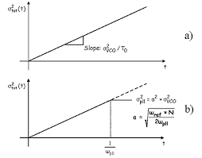

I realize when I'm sharing my knowledge with my colleagues, they are largely not Chinese users. Therefore I'll try to mark tech-related things down in English starting from today, in my blog.

## Introduction

I was taking [STAT150](https://undergraduate.catalog.berkeley.edu/courses/1220251) last semester from UC Berkeley. Although the teaching wasn't as engaging as I wished for, I was able to grasp most of the useful key concepts. One of the very useful mathematical models was the Poisson point process. 

I encountered this process once again when I was doing my link measurement, when we were supposed to benchmark the chip's bit error rate.

Here are two questions that arise from this:

> 1. If a link has a bit error rate of $10^{-15}$, what does this mean?
>     - Does this mean that if I send $10^{15}$ bits, I'm likely to see 1 error, or I'm likely to see some error?
> 2. If I were to benchmark a link's performance, how many bits should I send in order to confidently say that the link has a BER less than $10^{-15}$?
>     - Does sending $10^{15}$ bits and observing no error suffice?

Without giving direct answers to both questions, let's review some fundamentals.

## Poisson Distribution

We give the formal definition of a 1D Poisson distribution here.

> **Definition (Poisson Distribution):**
> A random variable $X$ follows a Poisson distribution with parameter $\lambda > 0$, denoted $X \sim \text{Poisson}(\lambda)$, if its probability mass function (PMF) is given by:
> 
> $$
> \begin{align}
> P(X = k) = \frac{\lambda^k e^{-\lambda}}{k!}, \quad k = 0, 1, 2, \ldots
> \end{align}
> $$
> 
> where $k!$ denotes the factorial of $k$.

**Key Properties:**

The mean and variance of a Poisson distribution are both equal to the parameter $\lambda$:

$$
\begin{align}
E[X] &= \lambda \\
\text{Var}(X) &= \lambda
\end{align}
$$

**Intuitive Interpretation:**

The Poisson distribution models the number of events occurring in a fixed interval of time or space, given that events occur independently at a constant average rate. The parameter $\lambda$ represents the expected number of events in that interval.

**Common Applications:**

- Number of arrivals in a queue during a time period
- Number of photons detected by a sensor in a fixed duration
- Number of errors in a data transmission over a fixed number of bits
- Number of radioactive decays in a given time window

## Poisson Point Process

> **Definition (Poisson Point Process):**
> 
> A Poisson point process (PPP) with rate (or intensity) $\lambda > 0$ is a stochastic process $\{N(t) : t \geq 0\}$ that counts the number of events occurring in the time interval $[0, t]$. It satisfies the following properties:
> 
> 1. **Independent Increments:** For any non-overlapping intervals $[t_1, t_2)$ and $[t_3, t_4)$ with $t_2 \leq t_3$, the number of events in these intervals are independent random variables.
> 
> 2. **Stationary Increments:** The distribution of the number of events in any interval depends only on the length of that interval, not on its starting time. Specifically, for any $t > 0$ and $s \geq 0$:
> $$
> \begin{align}
> N(s + t) - N(s) \sim \text{Poisson}(\lambda t)
> \end{align}
> $$
> 
> 3. **No Multiple Events:** The probability of more than one event occurring in an infinitesimal time interval $dt$ is negligible, i.e., $o(dt)$.
> 
> 4. **Initial Condition:** $N(0) = 0$.

**Counting Process Characterization:**

For a Poisson point process with rate $\lambda$, the number of events $N(t)$ in a time interval $[0, t]$ follows a Poisson distribution:

$$
\begin{align}
P(N(t) = k) = \frac{(\lambda t)^k e^{-\lambda t}}{k!}, \quad k = 0, 1, 2, \ldots
\end{align}
$$

The expected number of events in time $t$ is:

$$
\begin{align}
E[N(t)] = \lambda t
\end{align}
$$

**Inter-arrival Times:**

An important consequence of the Poisson point process is that the time intervals between consecutive events (inter-arrival times) are independent and exponentially distributed with rate $\lambda$. If $T_i$ denotes the time until the $i$-th event, then:

$$
\begin{align}
T_i \sim \text{Exponential}(\lambda), \quad f(t) = \lambda e^{-\lambda t}, \quad t \geq 0
\end{align}
$$

**Condition on Event Count:**

If we know $N(t) = k$, the positions of the $k$ events in the interval $[0, t]$ are distributed as independent and uniformly on $[0, t]$.

## How does this relate to bit error rate?

If we operate a link, whether it will yield an error depends on whether the random jitter exceeds the eye width, thus we sample the incorrect data. Random jitter, however, follows a Gaussian distribution. If we assume the clock is centered at the quadrature point, and the eye width happens to be $6\sigma$, then we immediately arrive at the conclusion that the probability of success is $99.6\%$. Given the clock is usually from a PLL whose jitter profile is a stationary process (after observing longer than the loop constant), we can safely say between symbols, the error probability is independent. Of course this is a very crude assumption because factors such as inter-symbol interference from a low-pass channel are not taken into account, but for simplicity let's move forward with this assumption.

A quick note is that an open loop oscillator's jitter sequence is not a stationary process; it's a random walk. Meaning if we observe long enough, the oscillator's phase deviation will grow unbounded. In the time domain, the jitter is just the instantaneous standard deviation, which grows over time.

Now, if we observe 10 such samples, each of them has independent success probability of $99.6\%$, it shouldn't be hard to see that the probability of all 10 samples being successful is $(0.996)^{10}$. The probability of having 1 error will be if one of them is having an error, and all others are successful. To extend this result, the error profile should follow a binomial distribution:

$$
\begin{align}
\text{Error} \sim \text{Bin}(N, p)
\end{align}
$$

where $N$ is the number of bits sent, and $p$ is the probability of error for each bit.

This whole story now sounds like we are flipping an uneven coin every single time, and the total error count follows a binomial distribution. How does this relate to Poisson process?

## Law of Rare Events

> **Theorem (Law of Rare Events, Poisson Limit Theorem):**
> 
> Let $X_n \sim \text{Bin}(n, p_n)$ be a sequence of binomial random variables where $n \to \infty$ and $p_n \to 0$ such that $n \cdot p_n \to \lambda$ for some constant $\lambda > 0$. Then:
> 
> $$
> \begin{align}
> \lim_{n \to \infty} P(X_n = k) = \frac{\lambda^k e^{-\lambda}}{k!}, \quad k = 0, 1, 2, \ldots
> \end{align}
> $$
> 
> In other words, $X_n \xrightarrow{d} X$ where $X \sim \text{Poisson}(\lambda)$.

**Intuitive Explanation:**

The Law of Rare Events states that when we have a large number of independent trials, each with a very small probability of success, the number of successes approximately follows a Poisson distribution. The key condition is that the product $n \cdot p$ (the expected number of events) remains constant as $n$ increases and $p$ decreases.

**Practical Implications for Bit Error Rate:**

In our BER context:
- $N$ is very large (number of bits transmitted)
- $p$ is very small (bit error probability, e.g., $10^{-15}$)
- The product $\lambda = N \cdot p$ is the expected number of bit errors

**Why This Matters:**

Computing probabilities with a binomial distribution requires calculating factorials and large powers, which is computationally expensive. The Poisson approximation provides:

$$
\begin{align}
P(\text{Error count} = k) \approx \frac{(Np)^k e^{-Np}}{k!}
\end{align}
$$

This is much simpler to work with, especially for answering our original questions about BER testing.

## To Answer the Two BER-Related Questions

Now, let's answer the two questions we had from the beginning.

**Question 1: If a link has BER = $10^{-15}$, what does this mean?**

This means that, on average, we expect 1 error for every $10^{15}$ bits transmitted. In other words, the probability of any single bit being in error is $10^{-15}$. However, it's totally possible that we receive 0 errors, 2 errors, 3 errors, and if you get super unlucky, all your received bits are erroneous, but this is super, super, super, super unlikely, although the probability is not zero.

We use the following table to illustrate the probabilities of different error counts when we send exactly $10^{15}$ bits with BER = $10^{-15}$:

| Error Count $k$ | $P(\text{Error} = k)$ | Cumulative Probability | Notes |
|---|---|---|---|
| 0 | $e^{-1} \approx 0.3679$ | 36.79% | No errors observed |
| 1 | $e^{-1} \approx 0.3679$ | 73.58% | Exactly 1 error |
| 2 | $\frac{1}{2}e^{-1} \approx 0.1839$ | 89.97% | Exactly 2 errors |
| 3 | $\frac{1}{6}e^{-1} \approx 0.0613$ | 96.10% | Exactly 3 errors |
| 4 | $\frac{1}{24}e^{-1} \approx 0.0153$ | 98.63% | Exactly 4 errors |
| 5 | $\frac{1}{120}e^{-1} \approx 0.0031$ | 99.94% | Exactly 5 errors |
| $\geq 6$ | $\approx 0.0006$ | $\geq 99.94\%$ | 6 or more errors |

**Interpretation:**

With $\lambda = 10^{15} \times 10^{-15} = 1$, the error count follows a Poisson distribution with parameter $\lambda = 1$. The table reveals several surprising facts:

1. **Zero errors are most likely:** There's a 36.79% chance of observing no errors at all!
2. **One error is equally likely:** One error is also expected with 36.79% probability.
3. **Multiple errors are possible:** There's a 27.4% chance of observing 2 or more errors.

This directly answers your first question: sending $10^{15}$ bits with BER $10^{-15}$ **does NOT guarantee** you'll see exactly 1 error. You're actually more likely to see either 0 or 1 error, with roughly equal probability.

**Question 2: How many bits should I send to confidently establish BER < $10^{-15}$?**

This is more complex and requires statistical hypothesis testing. However, we can provide some intuition using the Poisson model.

If we observe 0 errors after sending $N$ bits, what can we claim about the BER? Using the Poisson approximation with $\lambda = N \cdot p$:

$$
\begin{align}
P(\text{0 errors observed} \mid \text{true BER} = p) = e^{-Np}
\end{align}
$$

Now, here comes a concept called "confidence level." Confidence level means the probability of getting ourselves right. For example, if we want to confirm our bit error rate is <1e-15, but we only send 10 bits and see 0 errors, the confidence that I can safely say my bit error rate is <1e-15 is very low. However if I send 1e27 bits and I see 0 error so far, I can very confidently say that the link has BER <1e-15.

Then, how do we set our confidence level? What does this mean intuitively? Let's take it the contrapositive way:
- If I know my bit error rate = 1e-15, that means if I send 3e15 bits, it's 95% probable that I'll see at least 1 error.
- The contrapositive of the above statement is that, if I observe 0 errors after sending 3e15 bits, I can be 95% confident that the true BER is less than 1e-15.

The math is shown below:

$$
\begin{align}
e^{-Np} &= 0.05 \\
-Np &= \ln(0.05) \\
Np &\approx 2.996 \approx 3
\end{align}
$$

This means to claim BER < $10^{-15}$ with 95% confidence after observing zero errors, we need:

$$
\begin{align}
N \cdot 10^{-15} &= 3 \\
N &= 3 \times 10^{15}
\end{align}
$$

**So the answer to Question 2 is: No, sending $10^{15}$ bits and observing no error does NOT suffice.** You would need to send approximately $3 \times 10^{15}$ bits to claim with 95% confidence that the BER is less than $10^{-15}$.

## Beyond Raw BER testing

SiTime has this useful [webpage](https://www.sitime.com/support/design-development-tools/ber-confidence-level-calculator) to calculate the experiment time based on the required confidence level and desired accuracy.

In real practice, sending 1e27 bits is usually not physically possible. Take a 256Gbps parallel link for example, 1e27 bits testing will take 3.9e15 seconds, meaning 1e12 hours, meaning 123 million years to complete. I am not sure if human civilization will still exist by then. Therefore instead, people assume a jitter profile (DJ+RJ), for example dual dirac + Gaussian, and use only RJ component to estimate the true bit error rate. This is also known as the bathtub method.