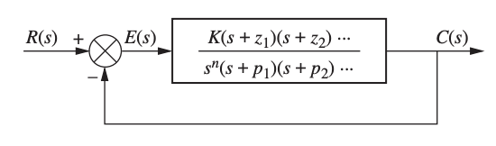
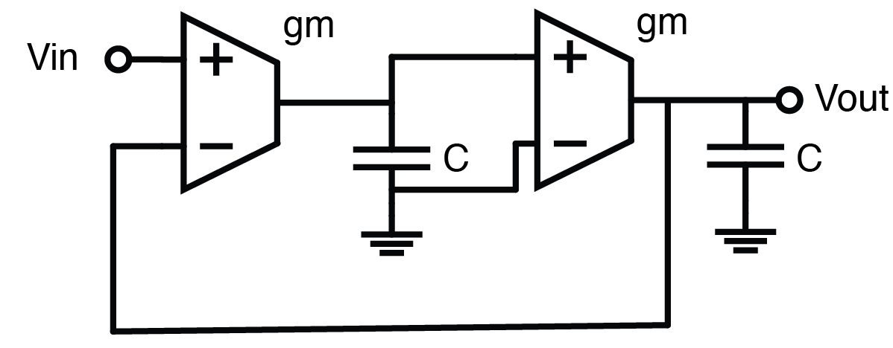
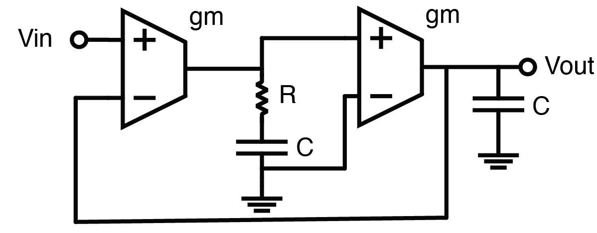

Before we resume talking about why adding a capacitor solves the step input problem without solving the ramp input problem, let's review some basic knowledge from linear system.

## Linear System Basics

### Initial Value Theorem

For a function $f(t)$ and its Laplace transform $F(s)$, the initial value theorem states that
$$
\lim_{t \to 0} f(t) = \lim_{s \to \infty} sF(s)
$$.

### Final Value Theorem

For a function $f(t)$ and its Laplace transform $F(s)$, the final value theorem states that
$$
\lim_{t \to \infty} f(t) = \lim_{s \to 0} sF(s)
$$.

### Types of Inputs

There are a few basic types of inputs that we use to kickstart the system. Here is a summary table:

| Input Type | Time Domain Response $f(t)$ | Laplace Transform $F(s)$ | Order |
|------------|------------------------------|-----------------------------|-------|
| Impulse | $\delta(t)$ | 1 | undefined |
| Step | $u(t)$ | $\displaystyle\frac{1}{s}$ | 0 |
| Ramp | $t \cdot u(t)$ | $\displaystyle\frac{1}{s^2}$ | 1 |
| Parabolic | $\displaystyle \frac{t^2}{2} \cdot u(t)$ | $\displaystyle\frac{1}{s^3}$ | 2 |
| ... | ... | ... | ... |

### Unity Feedback System
We call the following system a **Unity-Feedback System**, if the feedback path has a gain of 1.

## System Types

For a unity feedback system, we assume the controller has a transfer function that looks like:

$$ \displaystyle H(s) = \frac{K(s-z_1)(s-z_2)\cdots(s-z_m)}{s^k(s-p_1)(s-p_2)\cdots(s-p_n)} $$

That is, the controller has $m$ zeros, $n+k$ poles where $k$ poles are at the origin. To satisfy stability, $m < n+k$ otherwise the transfer function will not be a **proper transfer function**. 

> We define the **type** of the system as the number of pure integrators in $H(s)$. In our definition of $H(s)$, the type is $k$.

Now, if we sub $H(s)$ into the unity feedback system, using Mason's Gain Formula, we have the closed-loop transfer function of the overall system:

$$
\begin{align}
\displaystyle H_{cl}(s) &= \frac{H(s)}{1 + H(s)} \\
&= \frac{K(s-z_1)(s-z_2)\cdots(s-z_m)}{s^k(s-p_1)(s-p_2)\cdots(s-p_n) + K(s-z_1)(s-z_2)\cdots(s-z_m)}
\end{align}
$$

Therefore the transfer function of the steady-state error is given by:
$$
\begin{align}
E(s) &= 1 - H_{cl}(s) \\
&= \frac{1}{1 + H(s)} \\
&= \frac{s^k(s-p_1)(s-p_2)\cdots(s-p_n)}{s^k(s-p_1)(s-p_2)\cdots(s-p_n) + K(s-z_1)(s-z_2)\cdots(s-z_m)}
\end{align}
$$
Now, let's say if our input is type-N:
$$
\begin{align}
F(s) &= \frac{1}{s^{N+1}}
\end{align}
$$
Then the resulting steady-state error is going to be:
$$
\begin{align}
e(s) &= E(s) \cdot F(s) \\
&= \frac{s^{k-N-1}(s-p_1)(s-p_2)\cdots(s-p_n)}{s^k(s-p_1)(s-p_2)\cdots(s-p_n) + K(s-z_1)(s-z_2)\cdots(s-z_m)}
\end{align}
$$
If we apply final value theorem, we get
$$
\begin{align}
\lim_{t \to \infty} e(t) &= \lim_{s \to 0} s \cdot e(s)
&=\frac{s^{k-N}(s-p_1)(s-p_2)\cdots(s-p_n)}{s^k(s-p_1)(s-p_2)\cdots(s-p_n) + K(s-z_1)(s-z_2)\cdots(s-z_m)} 
\end{align}
$$
It's not too hard to see that the term of interest is $s^{k-N}$. We conclude therefore:
$$
\begin{cases}
\lim_{t \to \infty} e(t) = 0 & \text{if } k > N \\
\lim_{t \to \infty} e(t) = \frac{1}{K} & \text{if } k = N \\
\lim_{t \to \infty} e(t) = \infty & \text{if } k < N
\end{cases}
$$
This is a pretty elegant result, in otherwords, the convergence of steady state error follows such conditions:
1. If the system type (k) is greater than the input type (N), the steady-state error is zero.
2. If the system type (k) is smaller than the input type (N), the steady-state error will diverge to infinity.
3. If the system type and input type are the same, the steady state error will converge to a non-zero number, which will be a finite fraction of the input, depending on the DC gain of the system.

Another intuitive way to look into this is that, if our input is of a higher system and the system itself can't generate fast enough response, the system will always fall behind the input, and vice versa.

## The problems with higher order system

Now if we take the original system we discussed last time when we added a capacitor, we realize that adding that capacitor helped us to increase the system type, and thus we are able to track the input better.

Here is the further question: what if the input is of type 2? Based off our discussion just now, we might just want to add another integrator so as to further increase the system type, like below:

This makes plausible sense; however this system will unfortunately fail. Why? Let's try to simplify the system by assuming $g_m = 1$ and $C=1$. If we perturb our system by a step input, according to our discussion above, the system should be able to track it without problem. First, the open loop gain is given by:
$$
H_{ol} = \frac{1}{s^2}
$$
Now, if we closed the loop and calculate the closed loop gain:
$$
H_{cl} = \frac{1}{1 + H_{ol}(s)} = \frac{s^2}{1+s^2}
$$
With a step input, the output has a frequency domain representation of:
$$
V_{out}(s) = H_{cl} \cdot \frac{1}{s} = \frac{s}{1+s^2}
$$
Now if we perform inverse laplace transform of the s-domain representation, we will get:
$$ V_{out}(t) = \sin t$$
That is to say, we increased the system type and we wished for the steady state error to converge faster, however the system is not even able to track a type-1 input, but start oscillating. What's the problem here?

The reason is that by introducing another pole, we introduced 90 degrees more input phase, and thus the effective ** phase margin** of the system is 0. From another angle, we can apply Barkhausen stability criterion and realize that the system automatically satisfies that criterion, and immediately realize that the system is oscillatory. 

The fix is to introduce ** damping** to either of the integrator to produce a zero in the forward gain, thus making the phase margin positive. 

The derivation is left to our audience if you would like to give it a try.

---

For the next part, we will further expand the damping concept and introduce a few compensation techniques we can use: lead, lag, and lead-lag compensation to improve the system response.