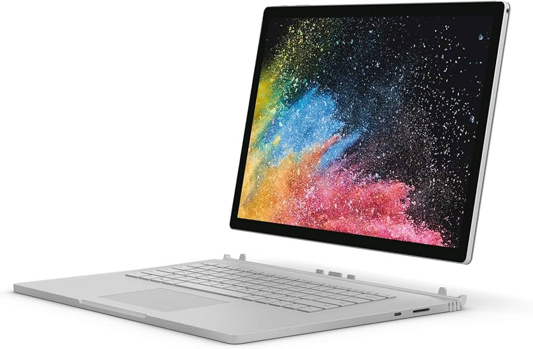

我的第一台笔记本电脑是2018年买的Surface Book 2，年少的我并没有想到这台笔记本是纯粹的电子垃圾，无法满足我的任何办公需求。一言以蔽之，SB2发热严重，不轻便，算力也很一般。他的唯一所谓亮点就是可以拆卸成一台平板加一个键盘，但是这个所谓功能其实也相当鸡肋。我学了这么久ASIC，我逐渐意识到各类东西各司其职其实就是最好的，人也是差不多的，让一个人同时干好多件事情的结果就是没一件事情能够干得好。这台SB2甚至无法完全盖上，简直是纯粹的电子垃圾。给没有见过SB2的读者感受一下什么叫做真正的SB：



因为那个铰链很大， 所以屏幕和键盘无法完全咬合。

另外的一个使用SB2的原因是当时我除了一台iphone8之外没有任何的其他苹果设备，并且我也对苹果生态嗤之以鼻。后来发现苹果作为一家科技公司有这么多拥簇者其实确实是有一定水平的。反过来看，Windows作为一个OS简直是一坨纯粹的屎山--在我毕业之后我一定会把我的desktop重装成Ubuntu26.04。

## 我的第一台M1 Macbook Air的光荣退役

我大三的时候把他二手在Carousell（或者可能是facebook marketplace上）1000刀卖给了一个新加坡的印度哥们，我还记得我当时搭了很久MRT去了市中心做了交易，然后回了NTU。换电脑的原因也很简单，当时的苹果自研M1芯片简直是如日中天，于是我决定拿我第一次实习赚的钱去升级一下我的设备，后来看来这是我的消费哲学启蒙。

这台电脑（如封面图左）大概从2020年底开始陪伴我度过了我的大学生涯的最后两年，以及博士生涯的前三年。从大三的HPC比赛（如电脑上的贴纸），到我的毕业设计，以及我PhD前三年偶尔出门读论文也是用的这台机器。她相当轻便，能够咬合（很重要的feature！！！），有着不错的续航以及恰到好处的计算能力，我平常就用她连vscode，读paper，收发邮件查阅资料。值得一提的是这个博客网站就是用她搭建的。

大概到了上个月我意识到M1已经是六年前的芯片了，并且得益于现代屎山软件的各种负优化，我在同时打开chrome，pdflatex编译和vscode的时候她的响应速度低的令人发指。因此我决定当机立断换一台M5 air，并且在我当机立断下单的那一天的第二天，这台机器[涨价了200刀](https://www.cnbc.com/2026/06/25/apple-macbook-ipad-price-hike-memory.html). 

我周五开车去了一趟Walnut Creek, 然后不使用migration assistant, 而是回家自己重新开始配置这台机器。我决定不在这台机器上安装不必要的软件，包括所有的聊天软件（包括telegram和slack），并且尽量使用homebrew包管理器。

有一个令我头痛的配置点是，我一直懒得配置一个git管理的dotfiles，这就给了我一个思考如何比较优雅地完成跨平台配置的机会。我会在接下来的部分讲解我的配置思路。

## Git Bare Repo
假如说我想要跨平台去设置我的vimrc, 我该怎么做？最简单的做法是把家目录整个当成一个git repository，然后只commit那些需要被commit的文件。这样的做法有一个很显然的坏处，那就是家目录下的其他git folder会让git感到困惑——git默认不支持嵌套的repository，你在家目录下运行`git status`的时候会看到一堆不相关的文件。

更优雅的做法是使用一个**bare repo**。所谓bare repo，就是一个只有`.git`内部数据结构、没有working tree的repository。我们把这个bare repo放在家目录之外的某个地方（比如`~/.dotfiles`），然后告诉git把家目录当成它的working tree：

```bash
# dotfile management
alias dot='git --git-dir=$HOME/.dotfiles/ --work-tree=$HOME'
dot config status.showUntrackedFiles no
```

最后一行是让`dot status`不显示家目录下所有未被追踪的文件，否则输出会非常嘈杂。之后把这个alias加到你的`.zshrc`或者`.bashrc`里，就可以像普通git一样管理dotfiles了：

```bash
dot add ~/.vimrc
dot add ~/.zshrc
dot commit -m "init dotfiles"
dot push
```

在新机器上还原配置也很简单：

```bash
git clone --bare <your-repo-url> $HOME/.dotfiles
alias dot='git --git-dir=$HOME/.dotfiles/ --work-tree=$HOME'
dot checkout
```

这套方案的妙处在于：家目录本身没有`.git`文件夹，所以不会干扰其他任何项目的git操作。整个配置也没有任何额外的工具依赖，只需要git。

## XDG Base Directory Specification

解决了dotfiles的版本管理问题之后，还有另一个问题：这些配置文件应该放在哪里？

在XDG标准出现之前，几乎每个工具都把自己的配置文件直接丢在家目录下——`.vimrc`、`.zshrc`、`.npmrc`、`.gitconfig`全都散落在一起，`ls -a ~`的输出看起来像一个垃圾场。[XDG Base Directory Specification](https://specifications.freedesktop.org/basedir-spec/latest/) 是由 freedesktop.org 制定的标准，试图解决这个问题，规定了不同类型的用户文件应该放在哪里。

标准定义了四个核心环境变量：

| 变量 | 默认值 | 用途 |
|---|---|---|
| `XDG_CONFIG_HOME` | `~/.config` | 配置文件 |
| `XDG_DATA_HOME` | `~/.local/share` | 持久化数据 |
| `XDG_CACHE_HOME` | `~/.cache` | 可随时删除的缓存 |
| `XDG_STATE_HOME` | `~/.local/state` | 状态文件（history、log等） |

如果这些变量没有被显式设置，工具应当回退到上表中的默认值。区分这四类的意义在于：`~/.cache`可以随时清空而不影响功能，`~/.local/share`里的数据需要备份但不需要纳入dotfiles，只有`~/.config`才是真正需要版本管理的配置。

和bare repo结合起来，dotfiles repo只需要追踪`~/.config/`这一个目录，而不是家目录下散落的各种`.`文件，结构清晰很多。

**现实情况**是很多工具并不原生遵循XDG，尤其是一些历史悠久的Unix工具。比如vim默认读取`~/.vimrc`，可以通过环境变量绕过：

```bash
# 加入 .zshrc
export VIMINIT='set nocp | source ${XDG_CONFIG_HOME:-$HOME/.config}/vim/vimrc'
```

Neovim则原生支持XDG，配置直接放在`~/.config/nvim/init.lua`即可，这也是很多人迁移到neovim的原因之一。[这个页面](https://wiki.archlinux.org/title/XDG_Base_Directory)维护了一份各工具对XDG支持情况的详细列表，配置新机器时可以作为参考。

## 我的设定
我把我的dotfiles用barerepo加XDG的方法推送到了[github上](https://github.com/cedard234/.dotfiles)。大概有我的htop，vimrc，tmux以及git的一些设置。如果你有兴趣，可以借鉴一些我的配置方法。